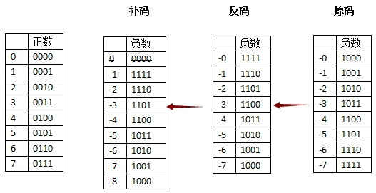
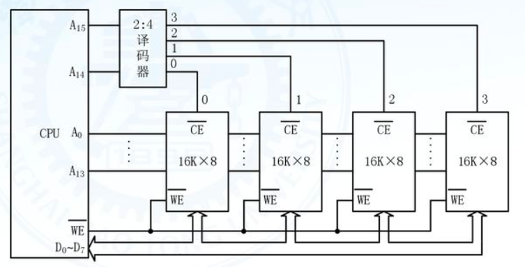
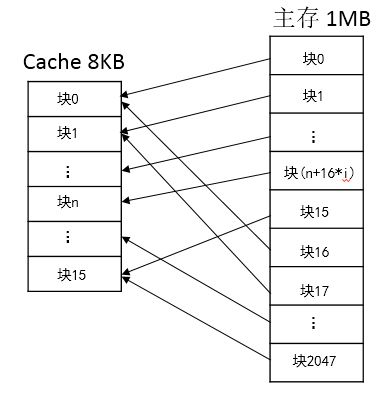
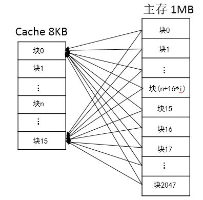
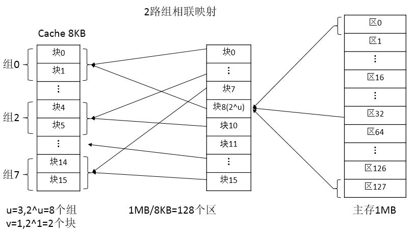

## 知识储备

### 大/小端方式

内存中的存储模式，它由 CPU 决定

对于一次能处理多个字节的CPU，存在着如何安排多个字节的问题，也就是大端和小端模式。以 int 类型的 0x12345678 为例，它占用 4 个字节，如果是小端模式（Little-endian），那么在内存中的分布情况为（假设从地址 0x 4000 开始存放）：

| 内存地址 | 0x4000 | 0x4001 | 0x4002 | 0x4003 |
| -------- | ------ | ------ | ------ | ------ |
| 存放内容 | 0x78   | 0x56   | 0x34   | 0x12   |


如果是大端模式（Big-endian），那么分布情况正好相反：

| 内存地址 | 0x4000 | 0x4001 | 0x4002 | 0x4003 |
| -------- | ------ | ------ | ------ | ------ |
| 存放内容 | 0x12   | 0x34   | 0x56   | 0x78   |

### 边界对齐

第一个成员存放在偏移量为0的位置；接下来的各成员存放在偏移量为该成员的类型所占字节数的整数倍的位置；特别地，当成员为结构时，该结构成员存放在偏移量为该结构成员内占空间最大的成员所占字节数的整数倍的位置

比如对于以下代码

```c
struct{
    int 	a;	// 4 Bytes
    char	b;	// 1 Bytes
    short	c;	// 2 Bytes
}record;
```

这么一个结构体在内存中的存储方式为

| Byte | Byte | Byte | Byte |
| ---- | ---- | ---- | ---- |
| a    | a    | a    | a    |
| b    | 留空 | c    | c    |

### 字长

8 位字长的计算机的 int 型为 8 bits

是的 32 位字长的计算机 int 型为 4 Bytes

**此外**：部分计算机是按字编址，字长成为最小地址单元，寻址范围 = 总内存 / 字长

##▲ 进制转换

### 二进制→其它

整数部分：小数点开始往左分配位数（跟进制数有关），不够往左边补零

小数部分：小数点开始往右分配位数（跟进制数有关），不够往右边补零

###其它→二进制

整数部分除基（进制）取余，得到的余数依次是对应进制数的低位到高位

小数部分乘基（进制）取整，得到的整数依次是对应进制数的高位到低位


##▲ 校验码

###海明

设置多个校验位，分组校验

原有 4 个信息位，添加 3 个校验位，合起来对应 7 位海明码。

将 4 位信息位分三组（同一位可以分在多个组中），即可生成3个校验位，每个校验位对应一组信息位

**校验原理**：每个 校验位 ⊕ 对应组的信息位，即可得到一个 3 位的二进制数，若为000，则无错误，若为010，则从右往左数的第 2 位出错

**即校验位表示的二进制数要覆盖整个海明码**

### CRC：循环冗余

发送接收双方约定一个多项式码 $G(n)$（记为生成多项式：比如1101对应的多项式为$x^3+x^2+x^0$）

要发送的是一个 K 位信息码，则将信息码左移多项式最高次幂 R = 3 位，得到一个 K+R 位的中间码，末尾 R 位 0

然后对中间码与多项式码 $G(n)$ 做模 2 除法，得到一个 R 位余数，这个 R 位余数写入中间码的后 R 位即可得最终CRC校验码

**模 2 除法**：异或运算，不借位

**校验原理**：将收到的CRC码与多项式码 $G(n)$做模 2 除法，余数为 000，则无错；若为 010，则从右往左数的第 2 位出错

## ★★★ 运算

###补码反码原码

有符号数：1是负号，0是正号



补码：解决了+0和-0同时存在的问题；另外"正负数相加等于0"的问题，同样得到满足

通常情况下数字都是以补码的形式保存的，在转换成十进制的时候要特别注意

### 移位

逻辑移位：整体移动，空位补 0 就完事儿了

算术移位：符号位不变，右移补符号位，左移补 0

##存储

###时间单位

**读周期**：两次连续的读操作必须经过的时间

**读取时间**：一个读周期里，从输入地址到数据电平稳定输出的这段时间

**硬件常识**：任何存储器，写入必须擦除原有数据，写速度比读速度慢不少

### CPU里的寄存器

CPU 中包含了两个与内存交互的寄存器，分别是MDR（Memory Data Register）和MAR（Memory Address Register）

MDR：存储器数据寄存器，用来作CPU与内存数据交互的缓冲区

MAR：里面存放了从内存中读/写数据的地址。MAR的位数映射到主存地址空间

###存储器

####RAM

RAM：随机存取

SRAM：速度快，成本高，集成度低。一般用于 Cache

+ 易失性（断电失去数据）
+ 非破坏性（读取信息仍保持原状态）；
+ 一般采取行列独立技术从内存中取数，每次取数要发送一次地址，一组行地址线，一组列地址线

DRAM：速度慢，成本低，集成度高。一般用于主机内存

+ 电荷存在一段时间后（就算不断电）会自动丢失，因此需要周期性地刷新（动态刷新，所以叫 Dynamic），好在刷新过程对 CPU 透明，另外DRAM按行刷新，刷新开销跟行数成正比
+ 行列地址复用技术从内存中取数，每次取数要发送两次地址（一次行地址，一次列地址）‍，共用一组地址线

####ROM

ROM：随机存取，一般用于主存（BIOS）

+ 只读，结构简单，位密度大
+ 非易失性（不加电长期保存），稳定可靠

FM：Flash Memory，闪存，可以快速擦除和重写

SSD：Solid State Drivers，固态硬盘，基于闪存，由控制单元和 Flash 存储芯片组成，比传统硬盘更快，功耗低，但价格贵

> 所以说，主存 = RAM + ROM（BIOS），别再说主存中全是 RAM
>
> 注意：开机启动时，操作系统最终要调入内存 RAM 中（系统区）运行

###扩展

####位扩展


特点：各芯片连接地址线的方式相同（每条地址总线接有所有负载/芯片），连接数据线的方式不同（一个芯片占据一根），读数据时要选中所有芯片（片选信号 CS 给到所有芯片）

####字扩展



特点：各芯片连接地址线的方式相同，连接数据线的方式相同（一个芯片连接整组数据线），读数据时要选中译码器选中的芯片即可

### CPU访存并行

#### 双端口存储器

统一存储器RAM，有两个独立的端口，两组独立的地址线，数据线，读写控制线

是一种在空间上的并行，缺陷是同时读写统一数据时会有冲突，需要额外的设计来处理

#### 多模块存储器

**时间概念**

+ 总线的传输周期：CPU取指令的时间间隔 t
+ 存储模块的存取周期：模块存取数据的时间间隔 T
+ 通常 t 要比 T 更短，因为 CPU 更快，考虑如何设计来协调 T 和 t ，以达到最佳 CPU 访存效率

**单体多字**：每个储存单元里存放多个字，一个存取周期内从一个地址取出多条指令

**多体并行**：一个存储体由多个模块组成，每个模块独立的地址寄存器，数据寄存器，控制电路，说白了每个模块有自己的存取周期。

+ 高位交叉：地址的高位决定模块的切换，换句话说地址低位连续递增时依然在同一个模块内，你得老老实实等待模块的存取周期过了才能下一次存取，本质就是串行，取 $n$ 条指令要 $nT$
+ 低位交叉：地址的低位决定模块的切换，每次地址递增就意味着模块的切换，你可以不等待当前模块的存取周期结束就直接去下一个模块取，真实并行，取 $n$ 条指令要 $T + (n-1)t$。t 也不要设置的太短，不要在一个 T 内轮完所有模块，否则会冲突；也不要在一个 T 内访问一个模块两次也可能会冲突

### Cache与主存

####主存块到Cache块的映射

直接映射：主存的每个块固定占有cache的一个块



 全相联映射：主存的每个块在cache里随便拿



组相联映射：主存的每个块在cache里对应一个组，组内随便用。内存中相邻的两个块对映在cache不同的两个组里



指令cache与数据cache分开是为了：减少指令流水线资源冲突

#### Cache块大小的计算

要知道内存地址到Cache地址的映射过程

首先，要知道Cache是比内存小的，所以一个Cache块是多个内存块的映射目的地，即已知【通过有效位】一个Cache块有内容，你是无法确定这个块区里究竟放的是哪个内存的块，所以Cache块里必须存放能够区分内存块的【标志位】

举个例子：

某计算机内存为256MB，按字节编址【256MB = $2^{28}$B，即一条内存物理地址有 28 个 bits，用这 28 个bits 去找一个Cache中的字节】

Cache中有8个行【8=$2^3$，内存地址里需要划分 3 位来定位行】

行大小为64B【8=$2^6$，定位到行后，还需要内存地址里划分 6 位来定位行内的具体字节】

最后地址中还剩下 28 - 3 - 6 = 19 位，这 19 位是高位地址，能唯一确定一个内存中的块，这19位就是标志位

所以

在题目**特别声明不考虑一致性维护和替换算法的控制位**，一个cache块的大小 = (1 + 19) bits + 内存块大小 ，记得统一单位

一般情况 cache块的大小 = 主存块大小

另外：若题目声明**采用写回法**，则还需要加上**一致性维护位** 1 bit

若声明了**替换算法**，则还要加上替换算法控制位 1 bit


#### 地址结构

逻辑地址：

| 虚拟页号P    | 页内偏移b        |
| ------------ | ---------------- |
| 查页表的表项 | 用于合成物理地址 |


虚拟页号：

| 标记位                        | 组号          |
| ----------------------------- | ------------- |
| TLB对应的组有这个标记位就命中 | 快表TLB的组号 |


页表项：

| 有效位 | 页框号           |
| ------ | ---------------- |
| 1/0    | 物理地址的页框号 |


物理地址：【页表中第P项里，有效位为1时，里面的页框号】+【页内偏移b】

| 标记位M          | 行/组号 | 行/块内偏移 |
| ---------------- | ------- | ----------- |
| 内存块的高位部分 | 行      | 字节为单位  |


Cache内容：

| 有效位 | 标记位                          |
| ------ | ------------------------------- |
| 0/1    | 要和物理地址中的 M 一致才算命中 |


##指令

### 结构

|