# 数据结构复习笔记

## 基础

### 时间复杂度

算法中**基本运算**的频度 *f(n)* 来分析时间复杂度

> Q：什么是 “基本运算”？
>
> A：最坏和最好描述的运算对象

不仅与问题规模有关，还与代输入数据的性质（初始状态）有关，根据不同的初始状态，可将算法时间复杂度分为以下三类：

+ 最好时间复杂度
+ 平均时间复杂度
+ 最坏时间复杂度：一般考虑这种情况


常见复杂度比较：

$O(1)<O(log_2n)<O(n)<O(nlog_2n)<O(n^2)<O(n^3)<O(2^n)<O(n!)<O(n^n)$


【2013】将两个长度分别为 $m$ 和 $n$ 的升序链表合并成一个长度为 $m+n$ 的降序列表，最坏时间复杂度为

A：O(max(m, n))

B：O(min(m, n))

> B：[合并算法](#链表合并)：两条链表的元素两两比较，最坏的是两条链中的元素依次比较{2，3，4，5}和{1，6}


【p11】思考斐波那契递归算法（递推公式 $F(n) = F(n-1) + F(n-2)$）的时间复杂度

> $O(2^n)$：可以想象成一个二叉树，每个父节点$F(n)$都有两个子节点$F(n-1)$和$F(n-2)$。


### 空间复杂度

算法**原地工作**：算法需要的辅助空间为常量O($1$)

[interactive tool](https://www.cs.usfca.edu/~galles/visualization/Algorithms.html)

**考试时花费大量时间思考一个问题的最优解是得不偿失的，$O(n)$的算法能拿11分的话，$O(n^2)$的算法能拿10分**

## 线性表

线性表是一种逻辑结构，其对应的存储结构有

+ 顺序表（数组）
+ 链表

### 顺序表（数组）

地址连续的存储单元

```c
// 静态分配
#define MaxSize 50			//最大容量
typedef struct{
    Type data[MaxSize];
    int Length;   			//当前长度
} SqList

// 动态分配
#define InitSize 100	
typedef struct{
    Type *data;
    int MaxSize, Length;   	//最大容量 和 当前长度
} SeqList
```

#### 插入

input：

+ i（表示第 i 个位置插入）
+ e（要插入的新元素）

process：

+ 先判断是否合法（ i 有无越界，数组长度有无限制等）
+ 将第 i 个以及之后的所有元素后移一位
+ 第 i 个位置放入 e
+ Length += 1

#### 删除

input：

+ i（表示删除第 i 个元素）

process：

+ 先判断是否合法（ i 有无越界）
+ 将第 i 个以及之后的所有元素前移一位
+ Length -= 1

#### 查找

input：e（查找元素值等于 e 的元素

process：

+ 遍历查找


【2010-循环左移】，一个序列 $a_0,a_1,a_2, … ,a_n$，要将此序列循环左移 $p$ 位 $(0<p<n)$，得到$a_{p}, a_ {p+1},a_{p+2}, … ,a_n, a_0, a_1, a_2, … ,a_{p-1}$ ，设计一个循环左移算法分析时间和空间复杂度

> 参考思路：将原串分成两个字串【0，p-1】和【p，n】，记将【1，2，3】反转为【3，2，1】的操作为Reverse，则 Reverse【Reverse【0，p-1】，Reverse【p，n】】即为循环左移的结果

```c
void Reverse(int R[], int from, int to){
    int temp;
    while(from < to){
        temp = R[from];
        R[from] = R[to];
        R[to] = temp;
        from ++;
        to --;
    }
}

void Converse(int R[], int n, int p){
    Reverse(R, 0, p-1);
    Reverse(R, p, n-1);
    Reverse(R, 0, n-1);
}
```

> 时间复杂度为$O(p/2)+O((n-p)/2)+O(n/2)=O(n)$ 
>
> 空间复杂度为$O(1)$


【2011-两个等长有序数组的中位数】即长度为 L 的数组中处在 L/2 位置的数称为“中位数”，如：

（11，13，15，17，19）中位数为 15

（2，4，6，8，11，13，15，17，19，20）中位数为 11

现有两个等长序列 A 和 B，设计一个算法找出 AB 合并后有序数列的“中位数”

> 参考思路：二分思维，记 A、B 的 “中位数“ 分别为 a、b，LA、RA分别为 A 被 a 分成的左右两部分，同理也有 LB、RB。
>
> ① 若 a=b ，则 a，b 都是所求的”中位数“
>
> ② 若 a<b ，则在 RA 和 LB 中找”中位数“
>
> ③ 若 a>b ，则在 LA 和 RB 中找”中位数“
>
> 参考代码：p25
>
> 时间复杂度为$O(log_2n)$ 
>
> 空间复杂度为$O(1)$

【扩展练习】[两个不一定等长有序数组的中位数](https://leetcode-cn.com/problems/median-of-two-sorted-arrays/solution/4-xun-zhao-liang-ge-you-xu-shu-zu-de-zhong-wei-shu/)


### 链表

#### 单链表

**头结点**：单链表的第一个节点前附加的节点，头结点数据域可以不设信息，也可以记录表长等相关信息

**表头**：如果带头结点的链表，头结点就是表头；不带头结点，表头就是第一个数据结点

**头指针**：指向表头

##### 建立

+ 头插法：新节点插入到头结点之后，作为第一个数据结点
+ 尾插法：需要增加一个指向表尾的指针，每次新节点加到末尾，更新尾指针

#### 双链表

比单链表多了一个前驱指针

#### 循环链表

循环单链表：将单链表中最后一个结点的指针指向头节点，在操作尾结点时要注意维持这一 ”环“ 的特性

循环双链表：… …

#### 静态链表

用数组实现的链表

| 数组下标       | 0（头结点） | 1    | 2    | 3            | 4    |      |
| -------------- | ----------- | ---- | ---- | ------------ | ---- | ---- |
| 数据           |             | b    | a    | d            |      | c    |
| 下一结点的下标 | 2           | 5    | 1    | -1（尾结点） |      | 3    |


## 栈和队列

### 栈

**栈是一种加了约束的线性表**

栈顶（Top）：允许出栈（删除）入栈（插入）的一端

栈底（Bottom）：最先进来的，最后出去的那个崽


基本操作：

```c
void InitStack(&S); // 初始化一个空栈
bool IsEmpty(S);	// 判断是否为空
void Push(&S, x);	// 若S未满，将元素x从栈顶放入
void Pop(&S, &x);	// 若S非空，将栈顶元素从栈顶拿出，并赋值给x
void GetTop(S, &x);	// 若S非空，读取栈顶元素，赋值给x
void Clear(&S);		// 销毁栈
```


#### 顺序栈

用数组实现的栈，连续内存

```c
#define MaxSize 50
typedef struct{
    Type data[MaxSize];
    int top;			// 栈顶指针，初始化或空栈时为-1，有内容时从0开始
} SqStack;
```

顺序栈内元素的个数 = S.top + 1


**共享栈**

两个栈在一块连续的内存，栈底分别在两端，栈顶向中间延申

```c
#define MaxSize 50
typedef struct{
    Type data[MaxSize];
    int top0;			// 0号栈的栈顶指针，初始化或空栈时为 -1
    int top1;			// 1号栈的栈顶指针，初始化或空栈时为 MaxSize
} GayStacks;
```

当 top1 - top0 = 1 时，栈满了


#### 链栈

采用无头结点的单链表实现，规定表头（第一个节点）为栈顶

【2013-进出栈分析】一个栈入栈先后顺序为$1，2，3，4，… ，n$，出栈先后顺序为$P_1,P_2,P_3,P_4,…,P_n$，若$P_2=3$ ，则 $P_3$ 可能的取值有___\_种

> 显然，从4开始往后的 $n-3$ 个数都行，$P_1=1$ 的话，$P_3$ 就可以为 2；同理$P_1=2$ 的话，$P_3$ 就可以为 1。
>
> 所以答案是 $n-1$种


### 队列

**操作受限的线性表**

队头：崽子们从这里出队

队尾：崽子们从这里入队


基本操作

```c
void InitQueue(&Q); 	// 初始化一个空队
bool IsEmpty(Q);		// 判断是否为空
void EnQueue(&Q, x);	// 若Q未满，将元素x入队，成为队尾
void DeQueue(&Q, &x);	// 若Q非空，将队首的崽拎出来，并赋值给x
void GetHead(Q, &x);	// 若Q非空，读取队首元素，赋值给x
```


#### 顺序队列

用数组实现的队列，连续存储

```c
#define MaxSize 50
typedef struct{
    Type data[MaxSize];
    int front;			// 队头，初始化 = 0，有崽子出队时，先取值，再+1，
    int rear;			// 队尾，初始化 = 0，有崽子入队时，先赋值，再+1。
    					// 所以队尾处始终为 null
} SqQueue;
```

缺点是：数组空间用完一遍后，front 和 rear 都跑到 MaxSize 去了，出队时释放的空间不能再用了

改进👇

**循环队列**

将数组逻辑上视为一个”环“，当 rear 因为元素入队跑到 MaxSize - 1 时，再入队一个崽，rear就取余运算变成 0，重新回到存储空间的开始位置

入队赋值后：`Q.rear = (Q.rear + 1) % MaxSize`

出队取值后：`Q.front = (Q.front + 1) % MaxSize`

队列长度：`Length = (Q.rear - Q.front + MaxSize) % MaxSize`

真·队满和队空时都有 `Q.front == Q.rear`，所以仅凭判断首尾相等是区分不了队满和队空的，需要一些措施

+ 将 ”队满“ 定义为 ”假·队满“ 即 `Q.front == (Q.rear + 1) % MaxSize 假·队满 : 未满`，当队尾快要超圈，但还差一个单元时，就认为队列已满
+ 在循环队列的类中添加一个成员变量 size 记录崽子个数
+ 在循环队列的类中添加一个成员变量 tag 来记录`Q.front == Q.rear`的原因是删除还是增加

#### 链式队列

一个单链表，头指针指向的是队头，尾指针指向的是队尾

```c
typedef struct{
    Type data;
    struct Node *next;
} Node;

typedef struct{
    Node *front, *rear;  // 队列的队头和队尾，初始化的时候都指向头结点，如果两者相等，则队列为空
} LinkQueue

```

通常这个单链表会设置一个头结点，Q.front 指向这个头结点，出队的是第一个数据结点，即头结点的下一个`Q.front->next` 被拎出去

#### 双端队列

两端都可以入队和出队


给一个入队序列，要会判断哪些序列是可能的出对序列。

+ 输出受限的双端队列：两端都能入队，只有一端能出队
+ 输入受限的双端队列：两端都能出队，只有一端能入队

### 栈和队列的应用

#### 括号匹配&表达式求值

表达式有以下三种不同记法

+ 中缀表达式：1 + (2 + 3) × 4 - 5
+ 前缀表达式：- + 1 × + 2 3 4 5
+ 后缀表达式：1 2 3 + 4 × + 5 -

人的大脑很容易理解与分析中缀表达式，但计算机更容易计算前缀或后缀表达式。

并且注意到只有中缀表达式是有括号来标志嵌套运算优先级的，前缀和后缀表达式并不需要括号就能处理。

所以计算表达式的值时，通常需要先将中缀表达式转换为前缀或后缀表达式，然后再进行求值。


【Q1】看看你的电脑如何处理后缀表达式：1 2 3 + 4 * +5 – 

1. 首先一个一个读入，是数字就压入栈（假设栈顶在右边，从右边入栈）中

> 1 2 3   // 读入了三个，全是数字，依次压栈

2. 读到了一个运算符号 + ，关键点来了！

这个 + 号告诉你现在要做一个加法，那么哪两个数字相加呢？**从栈里Pop出两个崽子**啊！

于是你从栈里 Pop 出了 3 和 2，并做了一个加法 $2+3=5$ ，得到的**结果再压回栈中**。

> 1 5     // 得到的 5 压回栈中，所以之前的 '2'，'3'，'+' 三个符号已经完成了它们的使命

3. 再往下读到 4，压进去

> 1 5 4

4. 再读到运算符号 * ，同样的操作方式，抓两个壮丁过来相乘，得到的结果压回去

> 1 20    // 5 × 4 = 20，20压回栈中

5. 再一个运算符 +，咳咳

> 21       // 1 + 20 = 21，21压回栈中

6. 一个数字 5，一个运算符 -

> 16       // 21 - 5 = 16

最终结果 16，

ps：这里最后一步的减法为什么是 21 - 5 而不是 5 - 21。再模拟一下读取到运算符（记为 o）的时候进行的操作：抓（从栈顶抓）两个壮丁，先抓到的叫A，后弹出的叫B，那么进行的运算是 B o A = Result，这个Result 压回栈


【Q2】如何进行各种缀的表达式之间的转换呢？

**中缀 → 后缀** 

运算符优先级：

| 运算符                   | (    | × ÷  | + -  | )    |
| ------------------------ | ---- | ---- | ---- | ---- |
| 进栈后优先级             | 1    | 5    | 3    | 6    |
| 进栈前（刚扫描）的优先级 | 6    | 4    | 2    | 1    |

算法：

+ 扫描到数字，直接添加到后缀表达式
+ 扫描到的运算符 a 的优先级 > 栈顶运算符 top 的优先级：a 进栈，扫描下一个
+ 否则弹出 top，并将 top 添加到后缀表达式
+ 然后再比较新的栈顶 newtop 和 a 的优先级，回到上两步

[参考博客](https://blog.csdn.net/weixin_40867255/article/details/82992690)

#### 栈与递归

递归的精髓：将原始问题转化为属性相同但规模更小的问题【递归体】，然后给出一个边界条件【递归出口】解出问题

在递归调用的过程中，系统为每一层的返回点、局部变量、传入实参等开辟了递归工作栈来进行数据存储。系统栈中保存的函数信息满足 **先调用 先进 后出** 的特点。

代码量少但效率不高，原因在于递归调用的过程中会包含对某一问题的重复求解【重复计算】

#### 队列与层遍历

二叉树的[层遍历](#遍历)

### 矩阵的压缩存储

多维数组：$（数组的）^n数组$ ，维度是一个逻辑上的，物理上的存储依然是一段连续的空间，拿二维数组来说，在物理存储上有两种映射方式

+ 按行优先：一行一行的  $|a_{00}|a_{01}|a_{02}|a_{10}|a_{11}|a_{12}|$
+ 按列优先：一列一列的  $|a_{00}|a_{10}|a_{01}|a_{11}|a_{02}|a_{12}|$

#### 对称矩阵

只存一半（主对角线+上/下三角区域）

对于 n 阶方阵，只用一个一维数组 B[$n(n+1)/2$] 即可，映射方式为行优先

#### 三角矩阵

不同于线性代数里的 “真·上下三角”（三角区域外全为0），这里的三角是指 “假·上下三角”（三角区域外全为一个常数C），因此要比上一个对称矩阵多出一项来放这个 C

#### 三对角矩阵

长这样：【三条斜线】

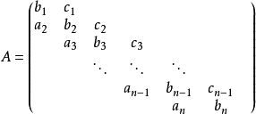

行优先映射就完事儿了，只存这块斜带区域的值

#### 稀疏矩阵

外形方面么得规律，但 0 元素超级多的矩阵

+ 用三元组（行，列，值）的数组保存
+ [十字链表](#十字链表)


## 树与二叉树

一些术语，记根节点为 R

+ 前驱节点和后继节点：分别表示父节点和子节点
+ 层数：根节点为第一层，层次往下递增
+ 树的高度：树中结点的最大层数，树能够到的最底层
+ 结点的高度：从叶节点开始向上逐层累加
+ 结点的深度：从根节点开始向下逐层累加
+ 祖先结点：对于一个结点K，从K到R**路径上的任意结点**称为K的祖先结点
+ 结点的度：一个结点的子节点个数称为该结点的度，树中结点的最大度称为树的度
+ 结点间的路径长度：两个结点路径上边的个数【路径是从上向下的，只有直系长辈和晚辈之间才有路径，兄弟节点是不存在路径的】
+ 结点路径长度：结点到根节点的路径长度
+ 森林：把一颗树的根节点拿掉，就变成了多棵树（森林）

### 二叉树

+ 满二叉树

+ 完全二叉树

    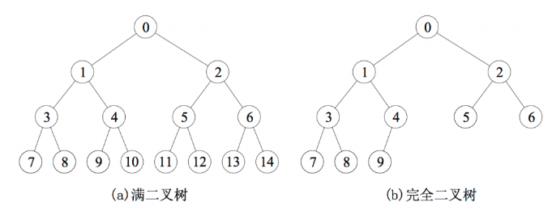

> 所有叶结点都位于同一层的完全二叉树就是满二叉树

+ [二叉排序树](#二叉排序树)：左子树所有结点关键字＜根结点关键字＜右子树所有结点关键字
+ [平衡二叉树](#平衡二叉树)：任一结点的左子树和右子树的深度之差不超过1


**存储结构**

顺序存储：数组，每一层最多有 1 2 4 8 个元素

链式存储：称为二叉链表

#### 遍历

先序遍历

```c
// recursive
void PreOrder(BiTree T){
    if(T != null){
        visit(T);           // 访问根节点
        PreOrder(T->left);	// 遍历左子树
        PreOrder(T->right); // 遍历右子树
    }
}
```

中序遍历

```c
// recursive
void InOrder(BiTree T){
    if(T != null){
        InOrder(T->left);	// 遍历左子树
        visit(T);           // 访问根节点
        InOrder(T->right);  // 遍历右子树
    }
}

// non-recursive
// 非递归算法需要借助一个辅助栈，记为 S

// 算法的思想
/*
	中序遍历是先遍历左子树，再访问（输出）根节点，再遍历右子树
	所以处理一个结点时，必定先检查它有没有左子树
		如果有左子树
			就先不处理这个结点（压栈保存）
			转而处理它的左子结点
		如果没有左子树
			就可以访问这个结点（出栈输出）
			然后再处理它的右子节点
	栈里面的结点都正在等待处理自己的左子树
	换句话说
		只要栈里有结点，那么正在处理的结点必定是栈顶的结点左子树上的结点
		栈空的时候，即正在访问的结点V的左子树已处理完毕，接下来要去处理V的右子节点
	所以
		当栈空 并且 这个V的右子节点也没了（为空），整棵树处理完毕
*/

// 思考：结点进栈的顺序就是前序顺序，出栈的结点排序就得到了中序序列 (○´･д･)ﾉ

void InOrder2(BiTree T){
    InitStack(S);
    BiTree p = T;
    
    while(p || !IsEmpty(S)){	// 栈不空：还有遇到过但暂时放一边没处理的点；p不空：还有没遇到的结点
        if(p){
            Push(S,p);			// 根结点进栈
            p = p->left;		// 处理左子树
        }
        else{
            Pop(S,p);			// 栈顶结点左子树处理完毕，弹出栈顶
            visit(p);			// 访问栈顶结点（根结点）
            p = p->right;		// 处理右子树
        }
    }
}
```

后序遍历

```c
// recursive
void PostOrder(BiTree T){
    if(T != null){
        PostOrder(T->left);		// 遍历左子树
        PostOrder(T->right);  	// 遍历右子树
        visit(T);           	// 访问根节点
    }
}
```

层遍历

```c
// 需要借助一个队列，记为 Q
void LevelOrder(BiTree T){
    InitQueue(Q);
    BiTree p;
    EnQueue(Q,T);
    while(!IsEmpty(Q)){
        DeQueue(Q,p);			// 队头出队，队头是队内这些结点中，原来在树里最上层最左边的结点
        visit(p);
        if(p->left)
            EnQueue(Q,p->left)	// 左子节点入队
        if(p->right)
            EnQueue(Q,p->right)	// 右子节点入队
    }
}
```

能还原出二叉树结构的序列：

+ 先序序列 + 中序序列：先序序列的第一个结点将中序序列分成左右子树（子序列），如此递归下去即可
+ 后序序列 + 中序序列
+ 层序序列 + 中序序列

不能还原成二叉树结构的序列：

+ 后序序列 + 先序序列：不能确定唯一一棵二叉树，但可以确定结点的祖先关系。
    + 比如 前序序列为 a，[……]，后序序列为 [……]，a；则可以确定 a 为 [……] 内所有结点的祖先。递归地分析 [……] 内的串，最终也能得到一些信息


【2017-先序和中序】一棵非空二叉树的先序和中序序列相同，则其所有的非叶结点需要满足的条件是___\_

> 看看先序和中序的递归算法表示，只要 p->left 为空，它们就是一样的代码。所以答案填：
>
> 左子树为空（或者：只有右子树）


【2015-先序序列的本质】先序序列为 $a,b,c,d$ 的不同二叉树的个数是___\_

> 仔细研究一下中序遍历非递归写法中用到的的栈，一个前序顺序入栈，一个中序顺序出栈，就能唯一确定一颗二叉树。所以等价于 “已知入栈顺序为 $a,b,c,d$ ，则出栈顺序有多少种？” 
>
> 对于 $n$ 个不同元素进栈，出栈序列的个数为 $\frac{1}{n+1}C_{2n}^{n}$ 种 [相当精彩的推导过程](https://blog.csdn.net/shikelang_pp/article/details/77170438)
>
> $n=4$ 带入得 14 种

> 【一些思考】
>
> Q1：一个 $n×n$ 的棋盘，一只崽在左下角，想走到右上角。可以向右，向上两个方向移动，但不能走到棋盘的上三角区，斜线上的点和下三角区域都能走，问有几种走法（不同的路径）
>
> 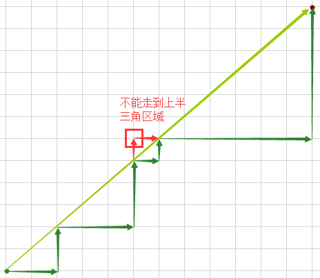
>
> Q2：已知 $n$ 个不同元素的进栈顺序，有几种可能的出栈序列？
>
> Q3：将 $n$ 个不同元素组成的序列视为二叉树的先序序列，能推导出多少棵不同的二叉树？
>
> 分析：
>
> Q1、Q2、Q3 三问其实是等价的
>
> + Q1本质上限制了横着走的格数≥竖着走的格数
> + Q2中进栈出栈必然是有进栈的次数≥出栈的次数
> + Q3中一个先序和一和中序唯一对应一棵二叉树，所以等价于已知先序序列能有多少中序序列，进一步分析中序遍历的非递归算法本质上就是先序进栈中序出栈，所以又回到了已知进栈序列求出栈序列种数的问题 = Q2
>
> 解决这些问题第一想法往往是递归回溯之类的，但其实这有通项公式，直接在 $O(1)$ 时间内解决不香吗


#### 线索二叉树

一个有 n 个结点的二叉树，有 n+1 个空指针【$2n-(n-1)$，n-1 是因为根节点上头没有对应的边】

> Q1：如何利用这些空指针？

一棵普通的链式二叉树，要获取某种遍历序列需要执行各种复杂遍历算法

>  Q2：有没有办法能直接找到一个结点在某种遍历序列中的前驱和后继？

Q1和Q2相互解决后的产物：线索二叉树（Threaded_tree）


**线索二叉树的结点结构**：

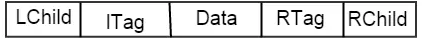

```c
typedef struct ThreadNode{
    Type data;
    struct ThreadNode *LChild, *RChild;
    int LTag, RTag;
} ThreadNode, *ThreadTree;
```

LChild：两种含义，既可以指向左子结点，也可以指向结点前驱。

Ltag：用来区分LChild的两种含义，1：前驱；0：左子结点。


**线索化**：

将普通二叉树变成某种遍历序列的过程。

构造线索二叉树时不破坏原有的指向左右子结点的指针，只将空指针指向该遍历序列的前驱或者后继结点，并设置对应的 tag。

线索化后的二叉树又称为**线索链表**，线索化后得到的序列有头部和尾部，即头部的 LChild 为 null，尾部的 RChild 为 null。

```c
// 中序线索化

void CreateInThread(ThreadTree T){
    ThreadTree pre = null;
    if(T != null){
        InThread(T, pre);		// 线索序列的第一个结点的前驱结点 pre 为 null
        						// 从 null 开始线索化 T
        
        pre->RChild = null;		// 线索序列的最后一个结点的后继结点 pre->RChild 为 null
        pre->RTag = 1;
    }
}


void InThread(ThreadTree &p, ThreadTree &pre){
    if(p != null){
        InThread(p->LChild, pre);	// 线索化左子树
        
        // ---
        if(p->LChild == null){		// 当前结点没有左孩子
            p->LChild = pre;		// 设置当前结点的的 LChild 为前驱结点 pre
            p->LTag = 1;			// 设置当前结点 p 的 LTag
        }
        
        if(pre != null && pre->RChild == null){	// 前驱节点没有右孩子
            pre->RChild = p;					// 设置前驱结点的后继结点 RChild 为当前节点 p
            pre->RTag = 1;						// 设置前驱结点的 RTag
        }
        // ---
        
        pre = p;
        InThread(p->RChild, pre);
    }
}
```


线索二叉树**长这样**👇

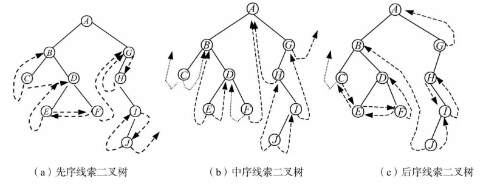

线索二叉树的操作：

线索二叉树能提供一些方便访问结点的方法

```c
// 以中序线索二叉树（中序序列）为例

/* 找到第一个结点 */
ThreadNode *FirstNode(ThreadNode *p){
    while(p->LTag == 0)
        p = p->LChild;		// 左下就完事儿了
    return p;
}

/* 找到最后一个结点 */
ThreadNode *LastNode(ThreadNode *p){
    while(p->RTag == 0)
        p = p->RChild;		// 右下就完事儿了
    return p;
}

/* 找任意结点 p 的后继结点 */
ThreadNode *NextNode(ThreadNode *p){
    while(p->RTag == 0)
        return FirstNode(p->RChild);	// 有右孩子的话后继结点必是右子树的第一个结点
    return p->RChild;					// 直接看线索
}

/* 找任意结点 p 的前驱结点 */
ThreadNode *NextNode(ThreadNode *p){
    while(p->LTag == 0)
        return LastNode(p->LChild);		// 有左孩子的话前驱结点必是左子树的最后一个结点
    return p->LChild;					// 直接看线索
}

/* 中序遍历 */
void InOrder(ThreadNode *root){
    ThreadNode *p = FirstNode(root);	// 找到第一个
    while(p){
        visit(p);
        p = NextNode(p);				// 下一个（遍历起来真的很舒服 o(*￣▽￣*)ブ
    }
}
```

[相关博客](https://www.timsrc.com/article/219/cue-binary-tree)

### 树、森林

#### 存储结构

三种常用结构：

+ 双亲表示法：数组存储，每个元素（结点）有 data 和 parent 两个属性，parent 指出该结点的双亲结点所在的数组下标，其中，根节点 parent 值为 -1，表示没有

+ 孩子表示法：每个节点的值用数组存起来，每个节点的孩子节点的下标用链表存起来

    ```c
    typedef struct CNode{
        Type data;			// 节点数据
        IndexNode* childs;  // 孩子下标链表
    } CNode;
    
    typedef struct IndexNode{
        int index;			// 在数组中的下标
        IndexNode* next;	// 下一个孩子下标结点
    } IndexNode;
    
    #define MaxSize = 50
    typedef struct CTree{
        CNode tree[MaxSize];// 数组
    } CTree;
    ```

+ 孩子双亲表示法：又称 “二叉树表示法”，结点包含三部分：data；指向第一个子结点的指针，指向下一个兄弟结点的指针

    ```c
    typedef struct CSNode{
        ElemType data;
        struct CSNode *FirstChild, *NextBrother;
    } CSNode, *CSTree;
    ```

    

#### 转换关系

[参考博客](https://blog.csdn.net/linraise/article/details/11745559)

树 与 二叉树：孩子双亲表示法的规则

森林 与 二叉树：

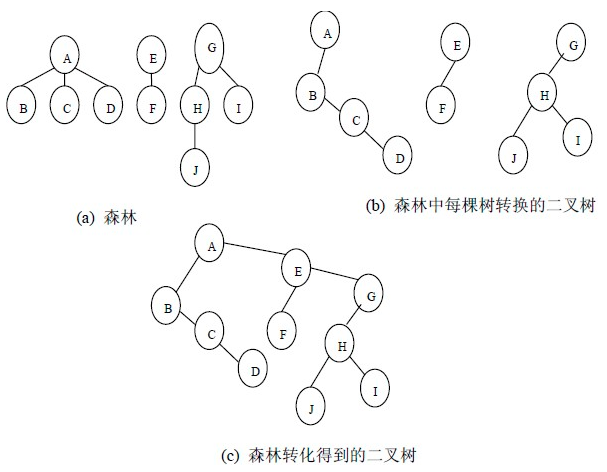

#### 遍历


树的遍历主要有两种：

+ 先根遍历：先访问根节点，再从左到右遍历每棵子树
+ 后根遍历：先从左到右遍历每棵子树，最后再访问根节点


森林的遍历两种

+ 先序遍历：
    + 访问第一课树的根节点
    + 先序遍历第一棵树中根节点的**子树森林**
    + 先序遍历除第一颗树外剩下的树构成的森林
+ 中序遍历
    - 中序遍历第一棵树中根节点的**子树森林**
    - 访问第一课树的根节点
    - 中序遍历除第一颗树外剩下的树构成的森林


遍历序列的对应关系

| 树       | 森林     | 二叉树   |
| -------- | -------- | -------- |
| 先根遍历 | 先序遍历 | 先序遍历 |
| 后根遍历 | 中序遍历 | 中序遍历 |


#### 并查集（Union-Find）

采用双亲表示法，全集（森林）由若干个小集合（树）组成

[有意思](https://blog.csdn.net/dm_vincent/article/details/7655764)；[interesting](https://blog.csdn.net/liujian20150808/article/details/50848646)；

一个全集合为 $S=\{0,1,2,3,4,5,6,7,8,9\}$，初始化时每个元素作为一个独立集合，不与其它元素有联系

一个元素 A 的 data：

+ +a 时：A 的双亲结点是 a 号元素
+ -a 时：A 是一个集合的代表（树的根节点），这个集合（树）一共有 a 个结点


初始化 $S$ 时，数组如下👇

| 元素 | 0    | 1    | 2    | 3    | 4    | 5    | 6    | 7    | 8    | 9    |
| ---- | ---- | ---- | ---- | ---- | ---- | ---- | ---- | ---- | ---- | ---- |
| data | -1   | -1   | -1   | -1   | -1   | -1   | -1   | -1   | -1   | -1   |


操作后，$S$ 内部分成了 3 个连通区（三棵树）$S_1=\{0,6,7,8\}$，$S_2=\{1,4,9\}$，$S_3\{2,3,5\}$，数组如下👇

| 元素 | 0    | 1    | 2    | 3    | 4    | 5    | 6    | 7    | 8    | 9    |
| ---- | ---- | ---- | ---- | ---- | ---- | ---- | ---- | ---- | ---- | ---- |
| data | -4   | -3   | -3   | 2    | 1    | 2    | 0    | 0    | 0    | 1    |

>  每个区域有一个代表（树的根节点）


在 $S_1$ 和 $S_2$ 两区域之间修一条路把两区域连起来，即取并集（$S_1∪S_2$）

| 元素 | 0    | 1    | 2    | 3    | 4    | 5    | 6    | 7    | 8    | 9    |
| ---- | ---- | ---- | ---- | ---- | ---- | ---- | ---- | ---- | ---- | ---- |
| data | -4   | 0    | -3   | 2    | 1    | 2    | 0    | 0    | 0    | 1    |

> 将 $S_2$ 的根节点变成 $S_1$ 根节点的小弟


#### 二叉排序树（BST）

**basic-rule**：左子树所有结点关键字＜根结点关键字＜右子树所有结点关键字

中序遍历二叉排序树可以得到关键字的递增序列

构造，查找，插入，删除这些操作只要维护这个 base-rule 即可

根据输入数据的顺序不同，构造出二叉排序树的结构也会不同，树的结构（高度）直接影响了排序树的查找效率


二叉排序树的查找与有序数组的二分查找的分析与对比

+ 单纯的二叉排序树的平均查找效率取决于树的高度 $O(h)$ ，数据增删效率高
+ 有序数组（顺序存储）的二分查找性能稳定为 $O(log_2n)$ ，但不适合数据的增删

所以，当有序表是静态查找表时，宜用顺序表存储二分查找；若有序表是动态查找表时，宜用二叉排序树


为了让二叉排序树性能稳定，除了要维护 basic-rule 之外，还要维护树的结构，升级为下面这个靓仔👇

#### 平衡二叉树（AVL）

每一个结点添加一个参数：平衡因子 = 左子树的高度 - 右子树的高度

维护树结构的方式是将平衡因子限制在 { -1，0，1 } 三个值（合理范围）内

构造，插入，删除这些操作的过程中，一旦某些结点的平衡因子超过了合理范围，就调整**最小不平衡子树**的结构，纠正平衡因子。【调整结构不能破坏 basic-rule】

如何**调整**？——四种旋转

[此处有很 nice 的交互](https://www.cs.usfca.edu/~galles/visualization/AVLtree.html)

+ RR — 左单旋转：二五仔在结点A的右孩子（R）的右子树（R）上

    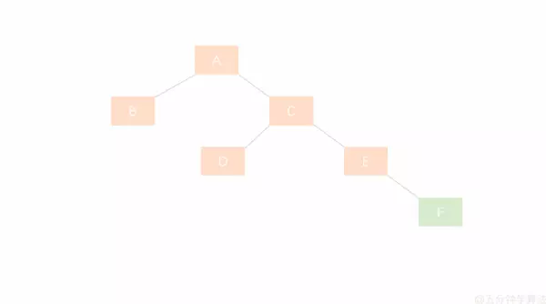


+ LL — 右单旋转：二五仔在结点A的左孩子（L）的左子树（L）上

    

+ LR — 先左后右：在结点A的左孩子（L）的右子树（R）上多一个二五仔【下图删除结点 30】

    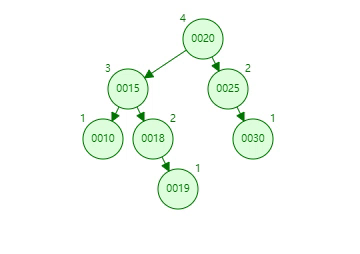

+ RL — 先右后左：在结点A的右孩子（R）的左子树（L）上多出二五仔【下图插入结点 18】

    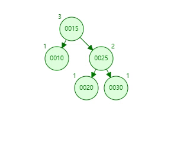

【2012-AVL树平衡因子】若平衡二叉树的高度为 6，所有非叶子结点的平衡因子均为 1，则该平衡二叉树的结点总数为___\_

> 记 $C_n$ 是高度为 $n$ 的平衡二叉树的结点总数，平衡因子为 1 得左子树结点数为 $C_{n-1}$ ，右子树结点总数为 $C_{n-2}$ ，可得递推公式： $C_n=C_{n-1}+C_{n-2}+1$ ，动手画画可得$C_1=1,C_2=2$；
>
> $n=6$ 带入得 20

【2013-AVL树的构造】将关键字 $1,2,3,4,5,6,7$ 依次插入初始为空的AVL树，最后树长什么样？

> [try yourself](https://www.cs.usfca.edu/~galles/visualization/AVLtree.html) 

【思考】AVL树长下面这样，现在删了 4 号男嘉宾，树会怎么变👇

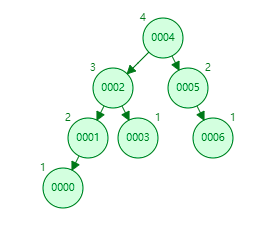

> 删除一个父节点后，会先把这个节点左子树上的最大值移动过去（维护 basic-rule）
>
> 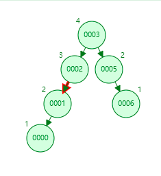
>
> 再维护平衡结构，最终结果如下
>
> 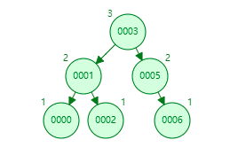
>
> 

#### 哈夫曼树（Huffman）

背景概念：

+ 结点被赋予一个表示某种意义的权值，称为**权**
+ 从根节点到任意结点的路径长度（经过的边数） × 这个节点的权 = 这个结点的**带权路径长度（WPL）**
+ 树中所有**叶节点**的带权路径长度**之和**为这棵树的带权路径长度


概念：

有一堆带权的结点，显然用这些点可以构造很多棵不同的树，而这些树中带权路径长度最小的那棵就是最靓的仔，江湖人称哈夫曼树，也叫*最优二叉树*。


将这堆结点构造成哈夫曼树的**算法**

>  自底向上的思想，将权值最低的放在最下面

1. 给出的 $n$ 个结点记为 $F$
2. 从 $F$ 中**移除**两个权值最小的节点，将它们的权值相加，形成一个新节点**加**到 $F$；（这个新结点就是两个权值最小的结点的双亲结点）
3. 重复 1，2 过程直到剩下最后一个结点，这就是根节点，这个根节点的权值就是哈夫曼树的带权路径长度

> 琢磨一下这个过程，发现哈夫曼树中没有度为 1 的结点，即父节点的权值不可能等于其子结点权值


应用：对每个字符使用固定长度的二进制串去编码的方式叫 **固定长度编码**，但由于字符出现的频率不同，有高频率有低频率，我们希望对高频率的字符用比低频的字符更短的编码长度，从而达到**数据压缩**的效果

这种变长编码方式称为**哈夫曼编码**，因为它能由哈夫曼树很自然地得到（字符频率为结点权值，0，1为结点左右子结点的边，叶子节点为字母，则从根结点到叶子结点的路径就是叶子节点字母对应的二进制串，）


**前缀编码**：任何一个字母的编码都不是另一个字母编码的前缀（能构造哈夫曼树，所有字符都在叶结点上）


下图对 'u', 'r', 'i', 'e', 'l', 'w', ' '（空格）七个字符的哈夫曼编码树[参考博客](https://blog.csdn.net/fx677588/article/details/70767446)

  

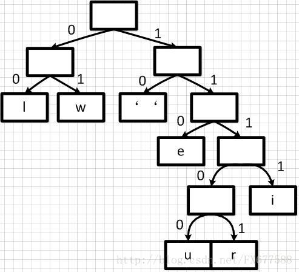


**数据压缩率**：

比如有 $a,b,c,d,e,f$ 六个字母，每个字母用 3 bits 来表示，一篇一百字母的文章需要 300 bits，

现统计文章中字母的频率分别为 45，13，12，16，9，5，构造哈夫曼树并计算WPL为 224 bits

则哈夫曼编码使得文章从 300 bits 压缩到 224 bits

【2012-多个有序列表合并】设有 6 个升序列表 A、B、C、D、E、F，分别含有 10、35、40、50、60、200个数据，要求通过 5 次两两合并，最终得到 1 个升序列表。设计一个最坏情况下比较次数最少的算法。

> 题目已经限制了合并操作为两两合并，所以不用考虑其它算法，像题目问的一样思考如何让比较次数最少。由于最先合并的表中元素在之后的每次合并都会被比较，所以要让元素少的序列最先合并，这种想法与哈夫曼树的思想不谋而合，构建一棵以元素数量为权重的哈夫曼树，让树的WPL最小即可
>
> 
>
> 【思考】自己思考一下合并多个升序序列的算法。
>
> 给出一种思路：假设有 $m$ 个序列，它们一共有 $n$ 个数，下方给出的是一个时间复杂度 $O(nlog_2m)$ 的算法。
>
> 维护一个含有 $m$ 个结点的最小堆，是的，这 $m$ 个结点指向 $m$ 个序列的第一个元素。每次取出堆顶数（所有序列中最小的），接着堆顶结点自然指向堆顶序列的下一个数，然后重新维护这个堆。如此往复，每取一个数，花费 $O(log_2m)$ 时间去维护堆结构，然后一共取 $n$ 次堆顶（n个数）。


## 图

基本概念：$G=(V,E)$ ：图 $G$ 有顶点集 $V$ （Vertex）和边集 $E$ 组成。

+ 图的边数： $|E|≥0$
+ 图的点数： $|V|>0$ ，也称图的**阶**。（图的点集不能为空）
+ 有向图：边（弧）由有序对表示 $<v,w>$ ，顶点 $v$ 指向 $w$ 的弧
+ 无向图：边由无序对表示 $(v,w)$
+ 简单图：两点之间最多一条边，不存在顶点到自身的边
+ 多重图：两点之间能有多条边，可以存在顶点到自身的边
+ 完全图：任意两个顶点之间都有边

    + 无向完全图： $|E| = |V|×(|V|-1)/2$
    + 有向完全图： $|E| = |V|×(|V|-1)$  
+ 子图：若 $V'\subset V$ 且 $E' \subset E$ ，则 $G'=(V',E')$ 为 $G$ 的子图，特别地，如果  $V'= V$ ，则  $G'$ 为 $G$ 的**生成子图**。【注意】$E'$ 中边的顶点都要在 $V'$ 中，不然 $G'$ 构不成图
+ 连通：无向图中，两个顶点之间有路径，则称两点**连通**

    + 连通图：图中的任意两点都连通的图，若 $|E|<|V|-1$ ，此图必不连通
    + 连通分量：无向图的**极大连通子图**，一个非连通图由若干个内部连通的小部分组成，但小部分之间没有边连着，这些小部分就叫连通分量
+ 强连通：有向图中，从顶点 $v$ 到 $w$ 和从 $w$ 到 $v$ 的路径都存在，则 $w$ 和 $v$ 强连通

    + 强连通图：图中的任意两点都强
    + 强连通分量：有向图的**极大强连通子图**
+ [连通图的生成树](#最小生成树)：包含全部顶点的**极小连通子图**，含有 $|V|-1$ 条边。若拿掉一条边，则变成非连通，若加上一条边，则会生成环路
+ 非连通图的生成森林：所有连通分量的生成树构成生成森林
+ 无向图顶点的度：顶点 $v$ 的度记为 $TD(v)$ ，依附于顶点 $v$ 的边数，全部顶点度之和等于 $2|E|$ 
+ 有向图顶点的度：等于该点的出度与入度之和

    + 出度：记为 $OD(v)$ ，以 $v$ 为起点的边的数目，全部顶点出度之和等于 $|E|$ 

    + 入度：记为 $ID(v)$，以 $v$ 为终点的边的数目，全部顶点入度之和等于 $|E|$ 
+ 稀疏图：边数很少，一般是 $|E|<|V|log_2|V|$ 的图
+ 回路：可以八字，拧麻花都行，只要起点等于终点。当 $|E|>|V|-1$ 时，必有环。有回路的图没有拓扑序列
+ 简单路径：顶点不重复出现的路径
+ 简单回路：除了起点终点相同外，其余点都不重复，不能拧麻花，只是单纯的圈圈
+ 路径长度：路径上边的条数


### 存储方式

#### 邻接矩阵（顺序存储）

有 $n$ 个顶点的图对应一个 $n×n$ 的矩阵 $A$ 
$$
A[i][j]  
\begin{cases}
  =a>0, & (v_i,v_j)或<v_i,v_j>这条（有向）边存在，a可以为边w_{ij}的权值 \\
  =0或∞, & (v_i,v_j)或<v_i,v_j>这条（有向）边不存在
\end{cases}
$$


```c
#define MaxVertexNum 100			// 顶点数的最大值
typedef char VertexType;			// 顶点数据类型
typedef int EdgeType;				// 带权图中边上权值的数据类型
typedef struct{
    VertexType Vex[MaxVertexNum];				// 定点表
    EdgeType Edge[MaxVertexNum][MaxVertexNum];	// 边表，邻接矩阵
    int vexnum, arcnum;							// 当前定点数和边数
} MGraph;
```

tricks：

+ 无向图的邻接矩阵是对称矩阵，用上[对称矩阵的压缩](#对称矩阵)
+ $A^n[i][j]$ 表示由顶点 $v_i$ 到 $v_j$ 长度为 $n$ 的路径数目
+ 第 $i$ 行（列）中非零（非∞）元素的个数与 $v_i$ 的度有关系哦
+ 适合存储稠密矩阵（边多的


#### 邻接表（链式）

Adjacency List）将所有的顶点用顺序存储，称为**顶点表**。然后以每个顶点为头建立自己的链表，链表上是所有依附于该顶点的边（通过记录的边另一端的顶点索引来表示这条边），这条链表称为**边表**。

[这里有博客](https://blog.csdn.net/jnu_simba/article/details/8866844)

无向图

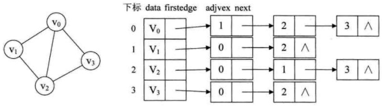

有向图

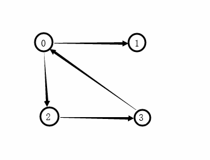

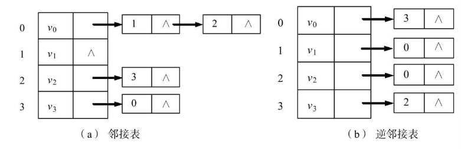

tricks

+ 用于存储稀疏图
+ 边链表上各边的顺序跟边的输入顺序有关，所以同一张图对应的邻接表有很多，换句话说基于邻接表存储的一张图，使用相同的遍历方式得到的遍历序列不唯一


#### 十字链表（链式-有向）

是有向图的一种链式存储结构，具有弧结点和顶点结点两种基本结点

顶点结点：顺序存储，包含了顶点的有效信息

+ firstin：从该顶点发出的一条边
+ firstout：指向该顶点的一条边
+ data

弧结点：链式存储，包含了一条有向边的所有信息

+ 尾域：tailvex，弧尾顶点（发出边的顶点）的索引
+ 头域：headvex，弧头顶点（边指向的顶点）的索引
+ 头链域：headlink，指向弧头相同的下一条弧结点
+ 尾链域：taillink，指向弧尾相同的下一条弧尾结点
+ 数据：data

长这样👇

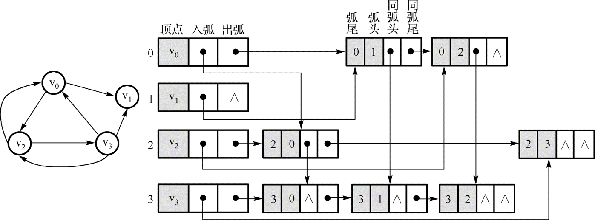

#### 邻接多重表（链式-无向）

Adjacency Multlist）是无向图的一种链式存储结构，可以看成是邻接表的靓仔版，解决了邻接表中删除一条边时要操作两个边结点和将一条边信息存储了两次的问题。

升级了边结点👇

+ 标志域：mark，用于标志这条边是否被搜索过
+ 顶点域：ivex 和 jvex，分别为这条边两个顶点的位置（索引）
+ 边域：ilink 和 jlink，分别指向下一条依附于 ivex 和 jvex 的边

>  依附于同一顶点的边连在同一条链中，每条边依附于两个顶点，所以每个边结点会出现在两条链上

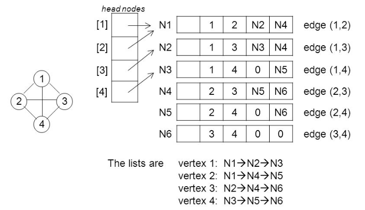

**总结**：十字链表和邻接多重表都将每条边建立一个结点存储这条边的所有信息，并且将有相同（信息）顶点的边连成链表

### 遍历

#### Breadth-FS

广度优先搜索，是一种逐层访问，需要借助辅助队列，和用于标记顶点是否被访问过的数组

```c++
// BFS Traverse a graph
bool visited[VERTEX_NUM] = {false}			// set all vertexes unvisited
Queue Q;									// auxiliary queue

void BFS_Traverse(Graph G){
    InitQueue(Q);							// init Q
    
    for(int i = 0; i < VERTEX_NUM; i++){	// 因为图 G 不一定是连通图
	    if(!visited[i]){					// 所以要对每个未访问过的顶点都尝试依次 BFS
	        BFS(G,i);
	    }
    }
}

void BFS(Graph G, int v){					// 能遍历顶点v所在的连通分量
    visit(v);
    visited[v] = true;						// 访问此顶点
    EnQueue(Q, v);							// 将此顶点入队
    
    while(!isEmpty(Q)){						// 队中还有顶点
        DeQueue(Q, v);
        for(auto w : G.GetNeighbors(v)){	// 该点所有邻居节点，就是一个层次
            if(!visited[w]){				// 之前没访问过
                visit(w);		
                visited[w] = true;			// 访问顶点
                EnQueue(Q, w)				// 入队
            }
        }
    }
}
```


性能分析：

+ 空间复杂度：每个顶点都要进入一次辅助队列Q，所以是 $O(|V|)$
+ 时间复杂度
    + 邻接矩阵：查找一个顶点的邻接点需要 $O(|V|)$ ，一共有 $|V|$ 个顶点，所以总时间复杂度为 $O(|V|^2)$
    + 邻接表：每条边访问一次，每个点访问一次，所以是 $O(|V|+|E|)$ <span>
                    <a class="d-inline-block" style="border-radius: 2px;padding: .15em 4px;background-color: #28a745; color: #FFF;font-size: 14px;">better</a>
                </span>


BFS-生成树：

在BFS过程中，存在明显的层次遍历思想，所以等价于以BFS起点为根节点，层遍历构造了一颗包含了连通分量所有顶点的树，这棵树就是**BFS-生成树**

从顶点 $u$ 到终点 $v$ 经过的最短边数（或者边的权值均为1的带权路径长度）称为**单源最短路径**，记为 $d(u,v)$ 。这条路径可以在BFS-生成树上很明显地体现出来（就是根结点 $u$ 到结点 $v$ 的路径长度）


#### Depth-FS

深度优先是一种会“回退”的方法，类似于树的先序遍历。尽可能地向下访问结点，当不能继续向下访问时，会回退到**最近**被访问的结点，这必然需要一个辅助栈。

如果递归的话，这个栈由系统提供；如果非递归，则由Coder设置

```c
// DFS Traverse a graph
bool visited[VERTEX_NUM] = {false}			// set all vertexes unvisited

void BFS_Traverse(Graph G){
    for(int v = 0; v < VERTEX_NUM; v++){	// 因为图 G 不一定是连通图
	    if(!visited[v]){					// 所以要对每个未访问过的顶点都尝试依次 DFS
	        DFS(G,v);
	    }
    }
}
// recursive
void DFS(Graph G, int v){				// 遍历顶点v所在的连通分量
    visit(v);
    visited[v] = true;					// 访问此顶点
    
    for(auto w : G.GetNeighbors(v)){	// 该点所有邻居节点
        if(!visited[w]){				// 之前没访问过
            DFS(Q, w)					// 递归往下，下面没有的话，就回到for循环
        }
    }
}
```


性能分析：

+ 空间复杂度：每个顶点进栈一次，$O(|V|)$
+ 时间复杂度
    - 邻接矩阵：查找一个顶点的邻接点需要 $O(|V|)$ ，一共有 $|V|$ 个顶点，所以总时间复杂度为 $O(|V|^2)$
    - 邻接表：每条边访问一次，每个点访问一次，所以是 $O(|V|+|E|)$ <span>
                    <a class="d-inline-block" style="border-radius: 2px;padding: .15em 4px;background-color: #28a745; color: #FFF;font-size: 14px;">better</a>
                </span>


DFS-生成树/森林

与BFS一样，不过DFS遍历有向图的时候可能生成森林（多棵树），原因是这个有向图不是连通图

> 【拓展】用 [tarjan](https://zhuanlan.zhihu.com/p/64916637) 算法计算割点

【两种遍历都能用于判断图的连通性】

### 最小生成树

[定义](#图)

要注意的是，如果是带权的无向连通图，那么在这个图的所有生成树中，所有边权值之和最小的生成树为最小生成树（MST：Minimum-Spanning-Tree）

**'当带权连通图找不到由权值相同的边构成的环' 是 '此连通图的MST唯一' 的充要条件**

#### Prim

Prim算法的每一步都会为一棵生长中的树添加一条边，该树最开始只有一个顶点，然后会添加$ V-1$个边。每次总是添加生长中的树和图中除该生长的树以外的部分具有最小权值的边。

```c
// 过程描述
void Prim(G,T){
    InitTree(T);							// 初始化一棵空树
    U = {G.RandomVertex()};					// 随便添加一个初始结点
    while(G.Vertex > U){					// 图中还有顶点没有添加到生成树中
        (u,v) = FindMinEdge(U,G.Vertex-U);	// 找树与非树两区域最近的一条路
        T = T.addEdge(u,v);					// 这条路添加到树中
        U = U.addVertex(v)					// 这条路在非树区的端点添加到树中
    }
}
```


时间复杂度，正常情况下为 $O(|V|^2)$ ，与边无关，所以适用于求解边稠密的图

> 可通过其它辅助方式优化时间复杂度（比如通过[Fibonacci heap](#https://www.cnblogs.com/skywang12345/p/3659060.html)把它[优化](http://keithschwarz.com/interesting/code/?dir=prim)成 $O(E+V\log V)$）知道这回事即可

#### Kruskal

按照边的权重顺序（从小到大）将边加入生成树中，但是若加入该边会与生成树形成环则不加入该边。直到树中含有$V-1$条边为止。这些边组成的就是该图的最小生成树。

时间复杂度为$O(|E|log|E|)$。

对比：Kruskal's grows **a forest of trees**, Prim's algorithm grows **a single tree**. Prim's algorithm only adds edges that join nodes to the existing tree. (In this respect, Prim's algorithm is very similar to [Dijkstra's algorithm](#Dijkstra) for finding shortest paths.)

[相关博客](https://blog.csdn.net/luoshixian099/article/details/51908175)

### 最短路径

#### Dijkstra[单源]

求带权图中某个源点到其余各顶点的最短路径

算法细节：用到三个辅助数组

+ s[vertex_num]：记录已求得最短路径的顶点，初始化s[$v_0$]=1，s[i]=1表示已经找到从起点 $v_0$ 到顶点 $v_i$ 的最短路径
+ dist[vertex_num]：dist[i] 记录从起点 $v_0$ 到顶点 $v_i$ 的最短路径长度
+ path[vertex_num]：path[i] 表示从起点 $v_0$ 到顶点 $v_i$ 的最短路径上 $v_i$ 的前驱节点，可用于路径回溯

```c
// 初始化辅助数组
void init(G,v){
    s[v]=1;									// 设置 v 为已访问
    S = {v};								// 将起点 v 加入 S
    for(int i = 1; i < G.VertexNum; i++){
        if(G.arcs[v][i] != INT_MAX) {		// 与起点有直接联系的先暂时设置好距离和路径
            path[i]=v;
            dist[i]=G.arcs[v][i];
        }
        else
            dist[i]=INT_MAX;				// 没直接连接的点距离设为无穷大
    }
}

void Dijkstra(G,v){
    init(G,v);
    for(int i = 1; i < G.VertexNum; i++){
        mid = Min(dist,V-S);			// V-S 表示还没访问过的点，从这些点中找出 dist 值最小的点
        s[mid]=1;
        S += mid;						// 可以确定这个 mid 的最短路径，并将它作为去其它点的中转点
        for(auto vertex : V-S){
            // 判断这个新加进来的点 mid 能不能提供一条去其它各点的更短的新路径
            if(dist[mid] + G.arcs[mid][vertex] < dist[vertex]){
                // 如果能提供一条经过 mid 后更短的新路径，就更新 dist 和 path
                dist[vertex] = dist[mid] + G.arcs[mid][vertex];
                path[vertex] = mid;
            }
        }
    }
}
```


时间复杂度：上述算法有两层循环，都是顶点，复杂度为 $O(|V|^2)$ 

局限性：有注意到上述算法的 S 用于保存当前已经确定找到了最短路径的顶点，所以不会再去 S 里面的点的 dist 和 path，但当图中的边带有负权值的时候，S的点就不再能保证是最短路径了，必须要再检查，所以Dijkstra不适用于权值为负的图


#### Floyd[全源]

用于无向图和有向图中任意两个点间的距离，必然有 $n^2$ 个值， $n×n$ 的方阵安排上

用两个方阵

+ D：D[i]\[j]表示 $v_i,v_j$ 两点之间的距离
+ P：P[u]\[v] = w ≠ -1，说明从点 u 到点 v 的最短路径上，u 的下一站是点 w ：path(u,v) = (u,w) + path(w,v)


算法思想：n 个顶点，有 n(n-1) 个路径（起点终点），为这些路径找中转点，看看有了中转点后路径长度是否会变短，如果会的话，就更新矩阵 D 和 P。n 个 顶点都能当一次中转点，所以时间复杂度是 $O(n^3)=O(|V|^3)$。

```c++
void Floyd(G){
    int n = G.VertexNum();
    int D[n][n], P[n][n] = {-1};
    D = G.arcs;
    
    for(int v = 0; v < n; v++){
        for(int i = 0; i < n; i++){
            for(int j = 0 ; j < n; j++){
                // 如果在 v 处中转能更近的话，就往 v 处走
                if( D[i][v] != MAX && D[v][j] != MAX  &&  D[i][j] > D[i][v] + D[v][j])
                {
                    P[i][j]= k;
                    D[i][j]= D[i][k] + D[k][j];
                }
            }
        }
    }
}
```

[参考博客](https://juejin.im/post/5cc79c93f265da035b61a42e)


### 拓扑排序

对有向无环图顶点的一种排序方式，表示活动的前后关系

算法：

1. 任意找一个没有前驱（入度为0）的顶点输出
2. 删除找到的顶点以及所有从这个顶点发出的边
3. 剩下的部分继续进行第 1 步，直到所有点都删完为止

时间复杂度：每个点删一遍，每条边删一遍，所以是$O(|E|+|V|)$ 

### 关键路径

顶点为事件，边为活动一个有向无环图，只有一个入度为 0 的点，一个出度为 0 的点，称这个图为AOE网络

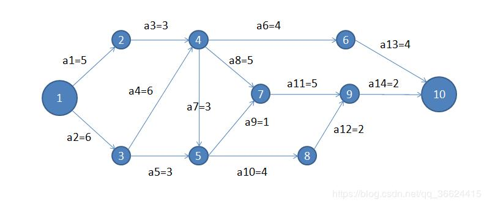

+ 事件的
    + 最早发生时间
    + 最晚发生时间
+ 活动的
    + 最早开始时间
    + 最晚开始时间

+ 关键路径：最早开始时间和最晚开始时间一样的活动构成的路径为关键路径，关键活动直接影响整个工程的完成时间

[参考博客](https://blog.csdn.net/wang379275614/article/details/13990163)


## 查找

一些概念

- 查找表：你查数据的地方

    - 静态查找表：只查询和检索
    - 动态查找表：查询检索+添加删除

- 查找长度：一次查找过程中关键字比较的次数

- 平均查找长度：衡量查找的算法效率的最主要标准，计算公式👇
    $$
    ASL=\sum_{i=1}^nP_iC_i
    $$

    - $n$ 查找表的长度
    - $P_i$ 查找第 $i$ 个元素的概率，通常是 $1/n$
    - $C_i$ 查找第 $i$ 个元素需要比较的次数

### 顺序查找和折半查找

#### 无序表

遍历喽~

说一下这个优雅的 “哨兵”，能避免不必要的判断语句，如下

```c
int Search_Seq(SSTable ST, Type key){
    // 把第一个元素当 key
    ST.elem[0] = key;
    
    // 从后往前，到 0 号必退出循环，绝不越界
    // 而且不需要 for 循环里的任何 if 哦
    // 优雅得飞起 o(*￣▽￣*)ブ
    for(int i = ST.length; ST.elem[i] != key; --i);
    return i;
}
```


#### 有序表（顺序查找）

查找成功的平均查找长度和遍历无序表时一样

但查找失败的话，可以提前退出而不用一直遍历到底（比如升序序列中已经从小到大遍历到一个比我大的数，但就是没有和我相同的数，这个时候就可以放弃了，因为后面的数必定比现在这个数还大，也就比我大）


#### 有序表（折半查找）

二分查找有序（顺序存储）数组

```c
int Binary_Search(SeqArray L, Type key){
    int low = 0, high = L.length - 1, mid;
    while(high >= low){
        mid = (low + high)/2;		// 这里选择了向下取整
        if(L[mid] == key)			// 还可以选择向上取整，但一棵树只能有一种取整方式，见下面的例题
            return mid;
        else if(L[mid] > key)
            high = mid - 1;
        else
            low = mid + 1;
    }
    return -1;
}
```

折半查找判定二叉树：把每次的 mid 位作为根节点构造二叉树即可

【2017-折半查找判定树】下列二叉树中，可能成为折半查找判定树（不含外部结点）的是

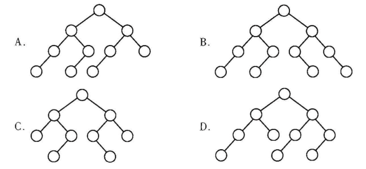

> 乍一看都是 AVL 树，肿么办，这其实考的是取整方式的一致性，即一棵树中二分比较时选取中点（即判定树的双亲节点）的取整方式
>
> 首先 A 选项，根节点左子树比右子树结点数多 1，说明是向上取整，之后的每一次分叉，都必须是向上取整，检查发现 A 满足
>
> 看 B ，左边单子结点的都是左子树，说明左边是向上取整，但右边却是向右偏，向下取整，矛盾！C、D同理都是矛盾错误的选项

【2010-比较次数】长度为 16 的有序数组，查找一个不存在的数，需要比较的次数为___\_

> $log_216+1=5$ 次


#### 分块查找

将顺序表分块，块外有序，块内无序；然后为每个块建了一个索引，查找时先查索引找块，再顺序查找块内

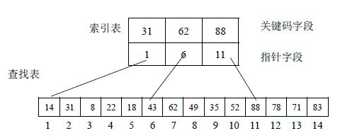

### B Tree & B+ Tree

回顾一下二叉树，每个数单独作为一个结点，一个数一个索引，当数据量很大的时候，索引并不能一次性读入内存，只能一页一页的读，每次往下走都需要磁盘IO。可以改进为多个数据条目共用一个结点（B树），再改进为将数据条目与索引分离（B+树）

#### B Tree

又称**多路平衡查找树**，B树的**阶**为最大子结点数，$m$ 阶的B树为 $m$叉树，每个结点不管是根还是叶都携带一个或多个索引以及数据条目

一棵 $m$ 阶B树的结点包含 $m$ 个指针和 $m-1$ 个关键字（数据），如下图，4 阶B树的结点中，4个竖条（指针）有 3 个隔间（关键字），指针时用来指向下一个结点的，意味着非叶节点最多有 $m$ 棵子树


B树的 **basic-rule** 

- 所有结点关键字是递增的，结点内左小右大
- 若根节点不是叶子节点，则其至少有2个子节点
- 除了根结点以外的所有非叶结点至少有（m/2 向上取整）棵子树，也就是（m/2 -1）个关键字
- 所有的叶子结点都在一层


为了维护B树的 basic-rule，在插入删除的时候，需要一些**操作**

- 分裂：如果在一个已经满了（已经有了 $m-1$ 个关键字）叶子结点中插入新数据，要将该结点均分成两个叶结点，并将中间的数提升到父结点中，如果父节点也满，再均分父节点，一直往上分直到满足要求为止，当根节点爆满时，同样均分根结点，并添加一个新的根节点，树的高度 +1.

- 合并：有一棵 5 阶的B树，根据basic-rule，计算得非叶结点至少有 5/2 向上取整 = 3 个指针，三个指针分隔出 2 个关键字，所以结点中最少要有两个关键字。在一个恰好有两个关键字的结点上删除一个关键字，则从底向上调整，两相邻兄弟借助父结点的关键字尝试匀开，匀不开（两兄弟都处在临界状态）的话就逐层合并兄弟结点

    > 下面这个 B-Tree 删除 11

    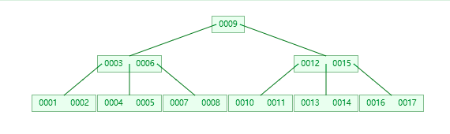

    > 得到

    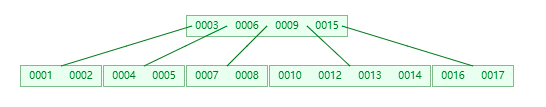

    > 如果不删除11，删除的是12，则有下面这个

    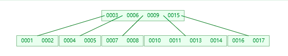

[在线玩B树](https://www.cs.usfca.edu/~galles/visualization/BTree.html)

【2014-关键字数与阶数】一个具有 15 个关键字的 4 阶 B 树中，最多能有几个结点？

> 4 阶，至少 2 索引，1 个关键字，不就成了二叉树嘛。所以是 15 个


#### B+ Tree

B+ 树可以视为查找表的索引树，非叶结点只包含（关键字）索引信息，不包含关键字对应的具体记录，是一种将记录与索引分离的方式。

它是应文件系统所需产生的 B 树的变形，适合作为操作系统中的文件索引和数据库索引

一个四阶的B+ Tree👇

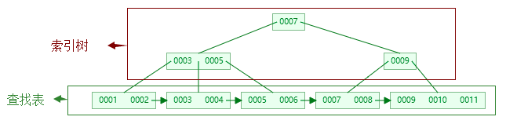


【≧ ﹏ ≦ 】有个问题：王道上B+树结点的结构是关键字数等于子结点数，即父结点的每一个关键字就是对应子树中的最小值。而上图以及 Google search 的 B+ 树都是关键字数 = 子结点数 - 1	

### 散列表

addr = hash(key)：通过哈希函数将关键字直接映射为数据条目存放地址

尽量做到不同的key不同的addr，如果不同的key映射到相同的addr，称为**冲突**，叫**堆积**


避免冲突的办法

- 开放定址法：在冲突的时候，通过一定的方式（线性探测顺序往下看，伪随机探测，等）找到另外一个空位置
- 拉链法：地址位上放的不是一个数，而是一个链表头，映射到这个地址的元素加在这个链表上


散列表的平均查找长度依赖于散列表的**装填因子**α，α定义为一个散列表的装满程度

>  装得越满越容易冲突

**平均查找长度**

- 查找成功时的平均查找长度
- 查找失败时的平均查找长度

【2010-散列表】

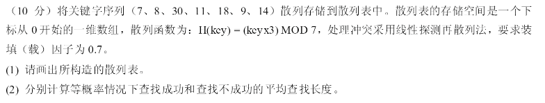

【解答】

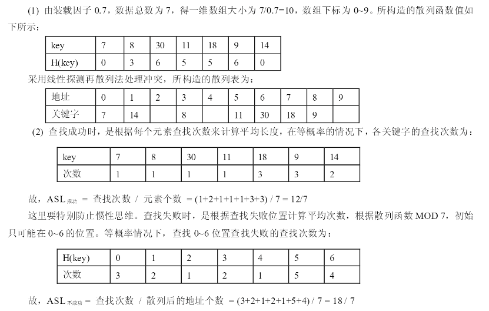

> 如何理解“查找失败”，比如我要查找 21，H(21)=0，从0开始找，算一次，发现0处并不是21而是7，根据线性探测法，往下再找一次，找到了1这个位置，发现还不是21而是14，再继续往下找一次，发现是空。好了，可以确定21不在这里，到目前为止一共找了 3 次。
>
> 那么为什么找到了空还没命中的话就认为查找失败呢，因为线性探测法是连续的，找到空就认为映射到 0 这个地址的元素已经没了。

### 串

- 顺序存储

- 块链存储

#### 模式匹配与KMP算法

目的：找到字串（模式串）在主串中的位置

简单模式匹配：在长为 $n$ 的主串中匹配到长为 $m$ 的字串的时间复杂度为 $O(mn)$


**KMP算法**

要理解它的思想：

它本质上是：对于一个主串 n，模式串 m，当我比较到 n[i]≠m[j] 的时候，接下来 i，j 要如何变化？（如果画图的话就是接下来模式串 m 要向右移动几位的问题）

这就要分析模式串 m，比如 m = “123456”，n = "123451……"；当我比到 n[5]≠m[5] 时，下一个直接比较 n[6] 和 m[1]就可以了，换句话说 m 串直接右移了 5 位，用人类的思维也是这么处理的，很好理解

计算机的话就需要先分析一下模式串，构造一个数组，来告诉计算机当 n[i]≠m[j] 的时候，接下来 i，j 要如何变化。

至于计算机如何分析模式串，常见的算法是找最长的相等前后缀长度

[相关文章](http://www.ruanyifeng.com/blog/2013/05/Knuth%E2%80%93Morris%E2%80%93Pratt_algorithm.html)


## 排序

排序算法的稳定性：若一个排序算法不会改变关键字相等的元素之间的相对位置，则称这个算法是稳定的。

> 比如A，B关键字相同，排序前 A 在 B左边，排序后 A 仍然在 B 的左边

稳定性并不用来衡量算法的优劣，只是算法的一个性质


- 内部排序：排序过程中数据全在内存里面，通过"比较"与"移动"的次数来衡量其时间复杂度
- 外部排序：排序过程中元素无法全部同时在内存中，要考虑磁盘IO数

[前人种树](https://github.com/hustcc/JS-Sorting-Algorithm)

### 插入排序

#### 直接插入

通过构建有序序列，对于未排序数据，在已排序序列中从后向前扫描，找到相应位置并插入。

是一个稳定的算法

适用于顺序存储和链式存储的线性表

时间复杂度：$O(n^2)$


#### 折半插入

直接插入的优化：通过二分查找的方式更快地找到在有序部分的插入位置，优化了比较的次数

是稳定算法

适用于**顺序存储**的线性表，既然是顺序存储，所以元素的移动依然是一个一个的

也就是说并未改变元素移动的次数，时间复杂度仍为 $O(n^2)$


#### 希尔排序

直接插入排序算法在**基本有序**的排序表中效果很好（比较和交换的次数都少），所以如果能通过事先处理让排序表的有序性更好，那么插入排序的效果会大大提高

是不稳定算法

适用于**顺序存储**的线性表


取一个初始步长 $d_1$ 将表分成 $d_1$ 组，每组进行**直接插入排序**

再缩小步长为 $d_2$ ，再**直接插入排序**

… …

直到步长为 1，即所有数据插入排序

> 可以看到缩小步长的过程中，整体有序性越来越强，排序速度到后面越来越快


这个步长也称增量，增量是减少的，因此希尔排序又叫**递减增量排序**

至于这个递减的方式，有待研究，一般是
$$
d_1=\frac{n}{2}; d_{i+1}=\frac{d_i}{2}
$$
通过选取合适的递减方式以及合适的 $n$ ，时间复杂度最好能达到$O(n^{1.3})$

[可视化](https://www.youtube.com/watch?v=n4sk-SzGvZA)

### 交换排序

#### 起泡排序

重复地走访过要排序的数列，一次比较两个元素，如果他们的顺序错误就把他们交换过来。

是稳定的算法

平均时间复杂度为：$O(n^2)$ 


#### 快速排序

快速排序又是一种**分治思想**在排序算法上的典型应用。本质上来看，快速排序应该算是在冒泡排序基础上的递归分治法。

找一个基准（pivot），把表划分（partition）O为 [小于基准的所有数，基准，大于基准的所有数]，然后对基准左右两部分子表递归调用划分，基本过程伪代码如下

```c
void QuickSort(Type L[], int low, int high){
    if(low < high){
        int pivot_position = Partition(L, low, high);	// 这里有一个划分函数
        QuickSort(L, low, pivot_position - 1);
        QuickSort(L, pivot_position + 1, high);
    }
}
```

而这个划分过程，即上述伪代码的 Partition() 函数有许多版本，下面给出考研考察的划分方法（严蔚敏）

```c
// 每次选取当前表的第一个元素为 pivot
int Partition(Type A, int low, int high){
    Type pivot = A[low];
    while(low < high){
        // 从最右边 high 开始往左看
        // 比基准大的数不动它，它本就应该在基准的右边，所以继续往左看 --high
        // 但当看到一个比基准小的，跳出这个 while
        while(low < high && A[high] >= pivot)
            --high;
        // 把这个出现在基准右边但是比基准小的 A[high] 放在基准左边，即赋值给 A[low]
        A[low] = A[high];
        
        // 与上述类似，从最左边 low 往右看，比基准小的不动，比基准大的放到右边 high 去
        while(low < high && A[low] <= pivot)
            ++high;
        A[high] = A[low];
    }
    // 直到最后整个列被 基准 成功划分为两部分，跳出大循环
    // 将基准值放在“中间”
    A[low] = pivot;
    return low;
}
```

从算法中可以看到影响算法时间复杂度的是 基准pivot 的选取，一个好的 pivot 能尽量把表分成等长的两部分，此时时间复杂度为 $O(nlog_2n)$，最坏情况是将表划分为 0 个 和 n-1 个元素，类似于单支二叉树，时间复杂度为$O(n^2)$ 

由于算法是递归地，所以空间上需要用到递归工作栈，空间复杂度与递归调用的深度有关，最好最坏情况与时间复杂度的最好最坏情况一致，最坏空间复杂度为 $O(n)$，平均空间复杂度为 $O(log_2n)$

优化方式：

- 当递归划分到规模较小的子表时不再递归，而直接插入排序
- Partition时选取尽量靠近中位数的 pivot

在左右区间元素交换的时候，很容易改变元素的相对位置，所以是不稳定算法


### 选择排序

#### 简单选择排序

第 $i$ 趟选择将表中第 $i$ 个到最后一个之间最小的数与第 $i$ 个数交换

不稳定排序：在第 $i$ 趟中，会把后半部分最小的和第 $i$ 个交换，如果这两者相等，则相对次序改变

时间复杂度必是 $O(n^2)$ 

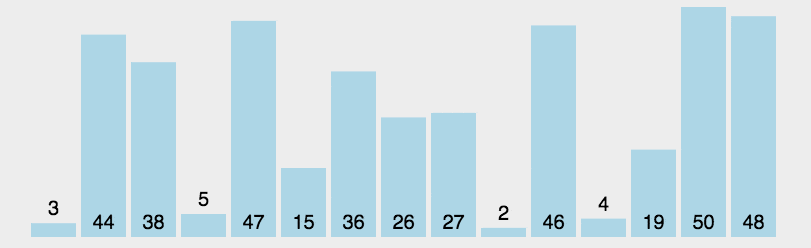

#### 堆排序

一个顺序存储的二叉树

它的**basic-rule**

- 任意一个父结点的关键字大于（或小于）它的两个子结点


顺序存储的二叉树的性质

- 将数组建成二叉树，必定是满二叉树。如果有 n 个结点，则前 （n/2 向下取整）个结点为非叶节点，剩下的后半部分为叶子结点
- 可以很方便地找到父结点和子结点。在堆中（编号从1开始）第 i 个结点的左子结点是第 2i 个，右子结点是第 2i+1 个


如何将顺序二叉树调整为一个最大堆（构造堆）

- 从最后一个非叶结点（第 n/2 个结点）开始往前依次**调整**所有非叶结点的子树
- 调整方式：记被调整结点为 A
    - 如果 A 有两个子结点，则先比较一次这两个子节点，选择更大的记为 B
    - 如果 A 只有一个子结点，就将这个子结点记为 B
    - 接着比较一次 A 和 B，如果 A＞B，无需调整，否则，把 A 和 B 换个位置；然后继续调整这个 A ，直到把 A 调整到符合 basic-rule 或者成为叶结点（n/2 后的部分）


删除结点：将最后一个结点与被删除结点交换，此时堆的 basic-rule 被破坏，但只要从新换上的最后一个结点开始往下调整二叉堆即可

添加节点：先放到堆的最后一个，在从这里往上调整堆即可


### 归并排序

**归并**：是一种能将若干个有序数组合并成一整个有序数组的操作

归并排序采用分治策略，若是将有序数组两两合并，则称为二路归并排序

将原始数据视为 $n$ 个包含一个数字的有序数列，开始两两合并，如此重复 … …，直到合并为一个长度为 $n$ 的有序数列

```c
void MergeSort(Type A[], int low, int high){
    if(low < high){
        int mid = (low + high)/2;
        MergeSort(A, low, mid);		// 左半部分递归调用归并排序
        MergeSort(A, mid+1, high);	// 右半部分递归调用归并排序
        Merge(A, low, mid, high);	// 将左右两个有序数列合并
    }
}

// 王道上给出的 Merge 升序数组操作如下
// 借助一个辅助数组 B，作为 A 的拷贝
// 每次从两个有序数组中取各自最小的进行比较，选择更小的
void Merge(Type A[], int low, int mid, int high){
    Type *B = Copy(A);
    /*
    i 是左边有序数组的索引
    j 是右边有序数组的索引
    k 最终结果数组（A）的索引
    */
    for(i=low, j=mid+1, k=i; i<=mid && j<=high; k++){
        if(B[i]<=B[j])
            A[k] = B[i++];
        else
            A[k] = B[j++];
    }
    while(i <= mid) A[k++] = B[i++];	// 右边的表已经比完了，直接拷贝左边的表
    while(j <= high) A[k++] = B[j++];	// 左边的表已经比完了，直接拷贝右边的表
}
```

是一种稳定的算法

时间复杂度：每趟归并的复杂度为 $O(n)$ 一共归并 $log_2n$ 趟（二路归并），所以一共是 $O(nlog_2n)$

空间复杂度：辅助数组 $O(n)$

### 基数排序

- 高位优先：MSD

- 低位优先：LSD


是一种稳定的算法

时间复杂度： $O(d(n+r))$

空间复杂度：$r$ 个队列 $O(r)$

### 外部排序

当文件记录超级多的时候，不能一次性全部读入内存排序，外部排序闪亮登场

通常采用归并排序的方法，首先将一个大文件分成若干更小的子文件，将子文件依次读入内存，子文件内部的记录排好序后**重新写回**磁盘，这些有序的子文件叫**归并段**或**顺串**，接着对这些归并段逐趟（这里的一趟可以视为归并树的一层）归并

将有序文件归并的过程是在内存中做的，不可能将两个有序段以及归并结果同时放在内存中，所以归并的过程是需要不停地将数据输入输出到磁盘，耗费大量时间

影响排序时间的主要是IO时间，因此要尽量减少IO次数，具体的方法可以增大归并路数，从而减少归并趟数

由于增大了归并路数，所以在归并的时候要快速地从各个归并段选出最小/大值，引入败者树

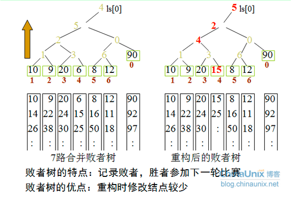

### 总结与比较


【排序算法的比较次数】下列四种排序算法中，比较次数与初始状态无关的是

A：选择排序

B：插入排序

C：快速排序

D：冒泡排序

> 选择排序的比较次数固定是 $n(n-1)/2$，所以选 A

【2015-元素的移动次数】元素的移动次数与关键字的初始排列次序无关的是

A：直接插入排序

B：快速排序

C：基数排序

D：冒泡排序

> 基数排序
