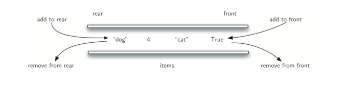

#数据结构复习笔记

## 基础

### 时间复杂度

算法中**基本运算**的频度 *f(n)* 来分析时间复杂度

> Q：什么是 “基本运算”？
>
> A：

不仅与问题规模有关，还与代输入数据的性质（初始状态）有关，根据不同的初始状态，可将算法时间复杂度分为以下三类：

+ 最好时间复杂度
+ 平均时间复杂度
+ 最坏时间复杂度：一般考虑这种情况


常见复杂度比较：

$O(1)<O(log_2n)<O(n)<O(nlog_2n)<O(n^2)<O(n^3)<O(2^n)<O(n!)<O(n^n)$


【2013】将两个长度分别为 $m$ 和 $n$ 的升序链表合并成一个长度为 $m+n$ 的降序列表，最坏时间复杂度为

A：O(max(m, n))

B：O(min(m, n))

> B：[合并算法](#链表合并)：两条链表的元素两两比较，最坏的是两条链中的元素依次比较{2，3，4，5}和{1，6}


【p11】思考斐波那契递归算法（递推公式 $F(n) = F(n-1) + F(n-2)$）的时间复杂度

> $O(2^n)$：可以想象成一个二叉树，每个父节点$F(n)$都有两个子节点$F(n-1)$和$F(n-2)$。


### 空间复杂度

算法**原地工作**：算法需要的辅助空间为常量O($1$)


**考试时花费大量时间思考一个问题的最优解是得不偿失的，$O(n)$的算法能拿11分的话，$O(n^2)$的算法能拿10分**

## 线性表

线性表是一种逻辑结构，其对应的存储结构有

+ 顺序表（数组）
+ 链表

### 顺序表（数组）

地址连续的存储单元

```c
// 静态分配
#define MaxSize 50			//最大容量
typedef struct{
    Type data[MaxSize];
    int Length;   			//当前长度
} SqList

// 动态分配
#define InitSize 100	
typedef struct{
    Type *data;
    int MaxSize, Length;   	//最大容量 和 当前长度
} SeqList
```

####插入

input：

+ i（表示第 i 个位置插入）
+ e（要插入的新元素）

process：

+ 先判断是否合法（ i 有无越界，数组长度有无限制等）
+ 将第 i 个以及之后的所有元素后移一位
+ 第 i 个位置放入 e
+ Length += 1

####删除

input：

+ i（表示删除第 i 个元素）

process：

+ 先判断是否合法（ i 有无越界）
+ 将第 i 个以及之后的所有元素前移一位
+ Length -= 1

####查找

input：e（查找元素值等于 e 的元素

process：

+ 遍历查找


【2010-循环左移】，一个序列 $a_0,a_1,a_2, … ,a_n$，要将此序列循环左移 $p$ 位 $(0<p<n)$，得到$a_{p}, a_ {p+1},a_{p+2}, … ,a_n, a_0, a_1, a_2, … ,a_{p-1}$ ，设计一个循环左移算法分析时间和空间复杂度

> 参考思路：将原串分成两个字串【0，p-1】和【p，n】，记将【1，2，3】反转为【3，2，1】的操作为Reverse，则 Reverse【Reverse【0，p-1】，Reverse【p，n】】即为循环左移的结果

```C
void Reverse(int R[], int from, int to){
    int temp;
    while(from < to){
        temp = R[from];
        R[from] = R[to];
        R[to] = temp;
        from ++;
        to --;
    }
}

void Converse(int R[], int n, int p){
    Reverse(R, 0, p-1);
    Reverse(R, p, n-1);
    Reverse(R, 0, n-1);
}
```

> 时间复杂度为$O(p/2)+O((n-p)/2)+O(n/2)=O(n)$ 
>
> 空间复杂度为$O(1)$


【2011-两个等长有序数组的中位数】即长度为 L 的数组中处在 L/2 位置的数称为“中位数”，如：

（11，13，15，17，19）中位数为 15

（2，4，6，8，11，13，15，17，19，20）中位数为 11

现有两个等长序列 A 和 B，设计一个算法找出 AB 合并后有序数列的“中位数”

> 参考思路：二分思维，记 A、B 的 “中位数“ 分别为 a、b，LA、RA分别为 A 被 a 分成的左右两部分，同理也有 LB、RB。
>
> ① 若 a=b ，则 a，b 都是所求的”中位数“
>
> ② 若 a<b ，则在 RA 和 LB 中找”中位数“
>
> ③ 若 a>b ，则在 LA 和 RB 中找”中位数“
>
> 参考代码：p25
>
> 时间复杂度为$O(log_2n)$ 
>
> 空间复杂度为$O(1)$

【扩展练习】[两个不一定等长有序数组的中位数](https://leetcode-cn.com/problems/median-of-two-sorted-arrays/solution/4-xun-zhao-liang-ge-you-xu-shu-zu-de-zhong-wei-shu/)


### 链表

####单链表

**头结点**：单链表的第一个节点前附加的节点，头结点数据域可以不设信息，也可以记录表长等相关信息

**表头**：如果带头结点的链表，头结点就是表头；不带头结点，表头就是第一个数据结点

**头指针**：指向表头

#####建立

+ 头插法：新节点插入到头结点之后，作为第一个数据结点
+ 尾插法：需要增加一个指向表尾的指针，每次新节点加到末尾，更新尾指针

#### 双链表

比单链表多了一个前驱指针

#### 循环链表

循环单链表：将单链表中最后一个结点的指针指向头节点，在操作尾结点时要注意维持这一 ”环“ 的特性

循环双链表：… …

#### 静态链表

用数组实现的链表

| 数组下标       | 0（头结点） | 1    | 2    | 3            | 4    |      |
| -------------- | ----------- | ---- | ---- | ------------ | ---- | ---- |
| 数据           |             | b    | a    | d            |      | c    |
| 下一结点的下标 | 2           | 5    | 1    | -1（尾结点） |      | 3    |


## 栈和队列

### 栈

**栈是一种加了约束的线性表**

栈顶（Top）：允许出栈（删除）入栈（插入）的一端

栈底（Bottom）：最先进来的，最后出去的那个崽


基本操作：

```c
void InitStack(&S); // 初始化一个空栈
bool IsEmpty(S);	// 判断是否为空
void Push(&S, x);	// 若S未满，将元素x从栈顶放入
void Pop(&S, &x);	// 若S非空，将栈顶元素从栈顶拿出，并赋值给x
void GetTop(S, &x);	// 若S非空，读取栈顶元素，赋值给x
void Clear(&S);		// 销毁栈
```


#### 顺序栈

用数组实现的栈，连续内存

```c
#define MaxSize 50
typedef struct{
    Type data[MaxSize];
    int top;			// 栈顶指针，初始化或空栈时为-1，有内容时从0开始
} SqStack;
```

顺序栈内元素的个数 = S.top + 1


**共享栈**

两个栈在一块连续的内存，栈底分别在两端，栈顶向中间延申

```c
#define MaxSize 50
typedef struct{
    Type data[MaxSize];
    int top0;			// 0号栈的栈顶指针，初始化或空栈时为 -1
    int top1;			// 1号栈的栈顶指针，初始化或空栈时为 MaxSize
} GayStacks;
```

当 top1 - top0 = 1 时，栈满了


#### 链栈

采用无头结点的单链表实现，规定表头（第一个节点）为栈顶

【2013-进出栈分析】一个栈入栈先后顺序为$1，2，3，4，… ，n$，出栈先后顺序为$P_1,P_2,P_3,P_4,…,P_n$，若$P_2=3$ ，则 $P_3$ 可能的取值有___\_种

> 显然，从4开始往后的 $n-3$ 个数都行，$P_1=1$ 的话，$P_3$ 就可以为 2；同理$P_1=2$ 的话，$P_3$ 就可以为 1。
>
> 所以答案是 $n-1$种


### 队列

**操作受限的线性表**

队头：崽子们从这里出队

队尾：崽子们从这里入队


基本操作

```c
void InitQueue(&Q); 	// 初始化一个空队
bool IsEmpty(Q);		// 判断是否为空
void EnQueue(&Q, x);	// 若Q未满，将元素x入队，成为队尾
void DeQueue(&Q, &x);	// 若Q非空，将队首的崽拎出来，并赋值给x
void GetHead(Q, &x);	// 若Q非空，读取队首元素，赋值给x
```


#### 顺序队列

用数组实现的队列，连续存储

```c
#define MaxSize 50
typedef struct{
    Type data[MaxSize];
    int front;			// 队头，初始化 = 0，有崽子出队时，先取值，再+1，
    int rear;			// 队尾，初始化 = 0，有崽子入队时，先赋值，再+1。
    					// 所以队尾处始终为 null
} SqQueue;
```

缺点是：数组空间用完一遍后，front 和 rear 都跑到 MaxSize 去了，出队时释放的空间不能再用了

改进👇

**循环队列**

将数组逻辑上视为一个”环“，当 rear 因为元素入队跑到 MaxSize - 1 时，再入队一个崽，rear就取余运算变成 0，重新回到存储空间的开始位置

入队赋值后：`Q.rear = (Q.rear + 1) % MaxSize`

出队取值后：`Q.front = (Q.front + 1) % MaxSize`

队列长度：`Length = (Q.rear - Q.front + MaxSize) % MaxSize`

真·队满和队空时都有 `Q.front == Q.rear`，所以仅凭判断首尾相等是区分不了队满和队空的，需要一些措施

+ 将 ”队满“ 定义为 ”假·队满“ 即 `Q.front == (Q.rear + 1) % MaxSize 假·队满 : 未满`，当队尾快要超圈，但还差一个单元时，就认为队列已满
+ 在循环队列的类中添加一个成员变量 size 记录崽子个数
+ 在循环队列的类中添加一个成员变量 tag 来记录`Q.front == Q.rear`的原因是删除还是增加

#### 链式队列

一个单链表，头指针指向的是队头，尾指针指向的是队尾

```c
typedef struct{
    Type data;
    struct Node *next;
} Node;

typedef struct{
    Node *front, *rear;  // 队列的队头和队尾，初始化的时候都指向头结点，如果两者相等，则队列为空
} LinkQueue

```

通常这个单链表会设置一个头结点，Q.front 指向这个头结点，出队的是第一个数据结点，即头结点的下一个`Q.front->next` 被拎出去

#### 双端队列

两端都可以入队和出队



给一个入队序列，要会判断哪些序列是可能的出对序列。

+ 输出受限的双端队列：两端都能入队，只有一端能出队
+ 输入受限的双端队列：两端都能出队，只有一端能入队

### 栈和队列的应用

#### 括号匹配&表达式求值

表达式有以下三种不同记法

+ 中缀表达式：1 + (2 + 3) × 4 - 5
+ 前缀表达式：- + 1 × + 2 3 4 5
+ 后缀表达式：1 2 3 + 4 × + 5 -

人的大脑很容易理解与分析中缀表达式，但计算机更容易计算前缀或后缀表达式。

并且注意到只有中缀表达式是有括号来标志嵌套运算优先级的，前缀和后缀表达式并不需要括号就能处理。

所以计算表达式的值时，通常需要先将中缀表达式转换为前缀或后缀表达式，然后再进行求值。


【Q1】看看你的电脑如何处理后缀表达式：1 2 3 + 4 * +5 – 

1. 首先一个一个读入，是数字就压入栈（假设栈顶在右边，从右边入栈）中

> 1 2 3   // 读入了三个，全是数字，依次压栈

2. 读到了一个运算符号 + ，关键点来了！

这个 + 号告诉你现在要做一个加法，那么哪两个数字相加呢？**从栈里Pop出两个崽子**啊！

于是你从栈里 Pop 出了 3 和 2，并做了一个加法 $2+3=5$ ，得到的**结果再压回栈中**。

> 1 5     // 得到的 5 压回栈中，所以之前的 '2'，'3'，'+' 三个符号已经完成了它们的使命

3. 再往下读到 4，压进去

> 1 5 4

4. 再读到运算符号 * ，同样的操作方式，抓两个壮丁过来相乘，得到的结果压回去

> 1 20    // 5 × 4 = 20，20压回栈中

5. 再一个运算符 +，咳咳

> 21       // 1 + 20 = 21，21压回栈中

6. 一个数字 5，一个运算符 -

> 16       // 21 - 5 = 16

最终结果 16，

ps：这里最后一步的减法为什么是 21 - 5 而不是 5 - 21。再模拟一下读取到运算符（记为 o）的时候进行的操作：抓（从栈顶抓）两个壮丁，先抓到的叫A，后弹出的叫B，那么进行的运算是 B o A = Result，这个Result 压回栈


【Q2】如何进行各种缀的表达式之间的转换呢？

**中缀 → 后缀** 

运算符优先级：

| 运算符                   | (    | × ÷  | + -  | )    |
| ------------------------ | ---- | ---- | ---- | ---- |
| 进栈后优先级             | 1    | 5    | 3    | 6    |
| 进栈前（刚扫描）的优先级 | 6    | 4    | 2    | 1    |

算法：

+ 扫描到数字，直接添加到后缀表达式
+ 扫描到的运算符 a 的优先级 > 栈顶运算符 top 的优先级：a 进栈，扫描下一个
+ 否则弹出 top，并将 top 添加到后缀表达式
+ 然后再比较新的栈顶 newtop 和 a 的优先级，回到上两步

[参考博客](https://blog.csdn.net/weixin_40867255/article/details/82992690)

#### 栈与递归

递归的精髓：将原始问题转化为属性相同但规模更小的问题【递归体】，然后给出一个边界条件【递归出口】解出问题

在递归调用的过程中，系统为每一层的返回点、局部变量、传入实参等开辟了递归工作栈来进行数据存储。系统栈中保存的函数信息满足 **先调用 先进 后出** 的特点。

代码量少但效率不高，原因在于递归调用的过程中会包含对某一问题的重复求解【重复计算】

#### 队列与层遍历

二叉树的[层遍历](#遍历)

### 矩阵的压缩存储

多维数组：$（数组的）^n数组$ ，维度是一个逻辑上的，物理上的存储依然是一段连续的空间，拿二维数组来说，在物理存储上有两种映射方式

+ 按行优先：一行一行的  $|a_{00}|a_{01}|a_{02}|a_{10}|a_{11}|a_{12}|$
+ 按列优先：一列一列的  $|a_{00}|a_{10}|a_{01}|a_{11}|a_{02}|a_{12}|$

#### 对称矩阵

只存一半（主对角线+上/下三角区域）

对于 n 阶方阵，只用一个一维数组 B[$n(n+1)/2$] 即可，映射方式为行优先

#### 三角矩阵

不同于线性代数里的 “真·上下三角”（三角区域外全为0），这里的三角是指 “假·上下三角”（三角区域外全为一个常数C），因此要比上一个对称矩阵多出一项来放这个 C

#### 三对角矩阵

长这样：【三条斜线】


行优先映射就完事儿了，只存这块斜带区域的值

#### 稀疏矩阵

外形方面么得规律，但 0 元素超级多的矩阵

+ 用三元组（行，列，值）的数组保存
+ 十字链表，长下面这样👇


## 树与二叉树

一些术语，记根节点为 R

+ 前驱节点和后继节点：分别表示父节点和子节点
+ 层数：根节点为第一层，层次往下递增
+ 树的高度：树中结点的最大层数，树能够到的最底层
+ 结点的高度：从叶节点开始向上逐层累加
+ 结点的深度：从根节点开始向下逐层累加
+ 祖先结点：对于一个结点K，从K到R**路径上的任意结点**称为K的祖先结点
+ 结点的度：一个结点的子节点个数称为该结点的度，树中结点的最大度称为树的度
+ 结点间的路径长度：两个结点路径上边的个数【路径是从上向下的，只有直系长辈和晚辈之间才有路径，兄弟节点是不存在路径的】
+ 结点路径长度：结点到根节点的路径长度
+ 森林：把一颗树的根节点拿掉，就变成了多棵树（森林）

### 二叉树

+ 满二叉树

+ 完全二叉树

    

> 所有叶结点都位于同一层的完全二叉树就是满二叉树

+ [二叉排序树](#二叉排序树)：左子树所有结点关键字＜根结点关键字＜右子树所有结点关键字
+ [平衡二叉树](#平衡二叉树)：任一结点的左子树和右子树的深度之差不超过1


**存储结构**

顺序存储：数组，每一层最多有 1 2 4 8 个元素

链式存储：称为二叉链表

#### 遍历

先序遍历

```c
// recursive
void PreOrder(BiTree T){
    if(T != null){
        visit(T);           // 访问根节点
        PreOrder(T->left);	// 遍历左子树
        PreOrder(T->right); // 遍历右子树
    }
}
```

中序遍历

```c
// recursive
void InOrder(BiTree T){
    if(T != null){
        InOrder(T->left);	// 遍历左子树
        visit(T);           // 访问根节点
        InOrder(T->right);  // 遍历右子树
    }
}

// non-recursive
// 非递归算法需要借助一个辅助栈，记为 S

// 算法的思想
/*
	中序遍历是先遍历左子树，再访问（输出）根节点，再遍历右子树
	所以处理一个结点时，必定先检查它有没有左子树
		如果有左子树
			就先不处理这个结点（压栈保存）
			转而处理它的左子结点
		如果没有左子树
			就可以访问这个结点（出栈输出）
			然后再处理它的右子节点
	栈里面的结点都正在等待处理自己的左子树
	换句话说
		只要栈里有结点，那么正在处理的结点必定是栈顶的结点左子树上的结点
		栈空的时候，即正在访问的结点V的左子树已处理完毕，接下来要去处理V的右子节点
	所以
		当栈空 并且 这个V的右子节点也没了（为空），整棵树处理完毕
*/

// 思考：结点进栈的顺序就是前序顺序，出栈的结点排序就得到了中序序列 (○´･д･)ﾉ

void InOrder2(BiTree T){
    InitStack(S);
    BiTree p = T;
    
    while(p || !IsEmpty(S)){	// 栈不空：还有遇到过但暂时放一边没处理的点；p不空：还有没遇到的结点
        if(p){
            Push(S,p);			// 根结点进栈
            p = p->left;		// 处理左子树
        }
        else{
            Pop(S,p);			// 栈顶结点左子树处理完毕，弹出栈顶
            visit(p);			// 访问栈顶结点（根结点）
            p = p->right;		// 处理右子树
        }
    }
}
```

后序遍历

```c
// recursive
void PostOrder(BiTree T){
    if(T != null){
        PostOrder(T->left);		// 遍历左子树
        PostOrder(T->right);  	// 遍历右子树
        visit(T);           	// 访问根节点
    }
}
```

层遍历

```c
// 需要借助一个队列，记为 Q
void LevelOrder(BiTree T){
    InitQueue(Q);
    BiTree p;
    EnQueue(Q,T);
    while(!IsEmpty(Q)){
        DeQueue(Q,p);			// 队头出队，队头是队内这些结点中，原来在树里最上层最左边的结点
        visit(p);
        if(p->left)
            EnQueue(Q,p->left)	// 左子节点入队
        if(p->right)
            EnQueue(Q,p->right)	// 右子节点入队
    }
}
```

能还原出二叉树结构的序列：

+ 先序序列 + 中序序列：先序序列的第一个结点将中序序列分成左右子树（子序列），如此递归下去即可
+ 后序序列 + 中序序列
+ 层序序列 + 中序序列

不能还原成二叉树结构的序列：

+ 后序序列 + 先序序列：不能确定唯一一棵二叉树，但可以确定结点的祖先关系。
    + 比如 前序序列为 a，[……]，后序序列为 [……]，a；则可以确定 a 为 [……] 内所有结点的祖先。递归地分析 [……] 内的串，最终也能得到一些信息


【2017-先序和中序】一棵非空二叉树的先序和中序序列相同，则其所有的非叶结点需要满足的条件是___\_

> 看看先序和中序的递归算法表示，只要 p->left 为空，它们就是一样的代码。所以答案填：
>
> 左子树为空（或者：只有右子树）


【2015-先序序列的本质】先序序列为 $a,b,c,d$ 的不同二叉树的个数是___\_

> 仔细研究一下中序遍历非递归写法中用到的的栈，一个前序顺序入栈，一个中序顺序出栈，就能唯一确定一颗二叉树。所以等价于 “已知入栈顺序为 $a,b,c,d$ ，则出栈顺序有多少种？” 
>
> 对于 $n$ 个不同元素进栈，出栈序列的个数为 $\frac{1}{n+1}C_{2n}^{n}$ 种 [相当精彩的推导过程](https://blog.csdn.net/shikelang_pp/article/details/77170438)
>
> $n=4$ 带入得 14 种

> 一些思考：
>
> Q1：一个 $n×n$ 的棋盘，一只崽在左下角，想走到右上角。可以向右，向上两个方向移动，但不能走到棋盘的上三角区，斜线上的点和下三角区域都能走，问有几种走法（不同的路径）
>
> 
>
> Q2：已知 $n$ 个不同元素的进栈顺序，有几种可能的出栈序列？
>
> Q3：将 $n$ 个不同元素组成的序列视为二叉树的先序序列，能推导出多少棵不同的二叉树？
>
> Q1、Q2、Q3 三问其实是等价的。

#### 线索二叉树

一个有 n 个结点的二叉树，有 n+1 个空指针【$2n-(n-1)$，n-1 是因为根节点上头没有对应的边】

> Q1：如何利用这些空指针？

一棵普通的链式二叉树，要获取某种遍历序列需要执行各种复杂遍历算法

>  Q2：有没有办法能直接找到一个结点在某种遍历序列中的前驱和后继？

Q1和Q2相互解决后的产物：线索二叉树（Threaded_tree）


**线索二叉树的结点结构**：


```c
typedef struct ThreadNode{
    Type data;
    struct ThreadNode *LChild, *RChild;
    int LTag, RTag;
} ThreadNode, *ThreadTree;
```

LChild：两种含义，既可以指向左子结点，也可以指向结点前驱。

Ltag：用来区分LChild的两种含义，1：前驱；0：左子结点。


**线索化**：

将普通二叉树变成某种遍历序列的过程。

构造线索二叉树时不破坏原有的指向左右子结点的指针，只将空指针指向该遍历序列的前驱或者后继结点，并设置对应的 tag。

线索化后的二叉树又称为**线索链表**，线索化后得到的序列有头部和尾部，即头部的 LChild 为 null，尾部的 RChild 为 null。

```c
// 中序线索化

void CreateInThread(ThreadTree T){
    ThreadTree pre = null;
    if(T != null){
        InThread(T, pre);		// 线索序列的第一个结点的前驱结点 pre 为 null
        						// 从 null 开始线索化 T
        
        pre->RChild = null;		// 线索序列的最后一个结点的后继结点 pre->RChild 为 null
        pre->RTag = 1;
    }
}


void InThread(ThreadTree &p, ThreadTree &pre){
    if(p != null){
        InThread(p->LChild, pre);	// 线索化左子树
        
        // ---
        if(p->LChild == null){		// 当前结点没有左孩子
            p->LChild = pre;		// 设置当前结点的的 LChild 为前驱结点 pre
            p->LTag = 1;			// 设置当前结点 p 的 LTag
        }
        
        if(pre != null && pre->RChild == null){	// 前驱节点没有右孩子
            pre->RChild = p;					// 设置前驱结点的后继结点 RChild 为当前节点 p
            pre->RTag = 1;						// 设置前驱结点的 RTag
        }
        // ---
        
        pre = p;
        InThread(p->RChild, pre);
    }
}
```


线索二叉树**长这样**👇


线索二叉树的操作：

线索二叉树能提供一些方便访问结点的方法

```c
// 以中序线索二叉树（中序序列）为例

/* 找到第一个结点 */
ThreadNode *FirstNode(ThreadNode *p){
    while(p->LTag == 0)
        p = p->LChild;		// 左下就完事儿了
    return p;
}

/* 找到最后一个结点 */
ThreadNode *LastNode(ThreadNode *p){
    while(p->RTag == 0)
        p = p->RChild;		// 右下就完事儿了
    return p;
}

/* 找任意结点 p 的后继结点 */
ThreadNode *NextNode(ThreadNode *p){
    while(p->RTag == 0)
        return FirstNode(p->RChild);	// 有右孩子的话后继结点必是右子树的第一个结点
    return p->RChild;					// 直接看线索
}

/* 找任意结点 p 的前驱结点 */
ThreadNode *NextNode(ThreadNode *p){
    while(p->LTag == 0)
        return LastNode(p->LChild);		// 有左孩子的话前驱结点必是左子树的最后一个结点
    return p->LChild;					// 直接看线索
}

/* 中序遍历 */
void InOrder(ThreadNode *root){
    ThreadNode *p = FirstNode(root);	// 找到第一个
    while(p){
        visit(p);
        p = NextNode(p);				// 下一个（遍历起来真的很舒服 o(*￣▽￣*)ブ
    }
}
```

[相关博客](https://www.timsrc.com/article/219/cue-binary-tree)

### 树、森林

#### 存储结构

三种常用结构：

+ 双亲表示法：数组存储，每个元素（结点）有 data 和 parent 两个属性，parent 指出该结点的双亲结点所在的数组下标，其中，根节点 parent 值为 -1，表示没有

+ 孩子表示法：每个节点的值用数组存起来，每个节点的孩子节点的下标用链表存起来

    ```c
    typedef struct CNode{
        Type data;			// 节点数据
        IndexNode* childs;  // 孩子下标链表
    } CNode;
    
    typedef struct IndexNode{
        int index;			// 在数组中的下标
        IndexNode* next;	// 下一个孩子下标结点
    } IndexNode;
    
    #define MaxSize = 50
    typedef struct CTree{
        CNode tree[MaxSize];// 数组
    } CTree;
    ```

+ 孩子双亲表示法：又称 “二叉树表示法”，结点包含三部分：data；指向第一个子结点的指针，指向下一个兄弟结点的指针

    ```c
    typedef struct CSNode{
        ElemType data;
        struct CSNode *FirstChild, *NextBrother;
    } CSNode, *CSTree;
    ```

    

#### 转换关系

[参考博客](https://blog.csdn.net/linraise/article/details/11745559)

树 与 二叉树：孩子双亲表示法的规则

森林 与 二叉树：


#### 遍历


树的遍历主要有两种：

+ 先根遍历：先访问根节点，再从左到右遍历每棵子树
+ 后根遍历：先从左到右遍历每棵子树，最后再访问根节点


森林的遍历两种

+ 先序遍历：
    + 访问第一课树的根节点
    + 先序遍历第一棵树中根节点的**子树森林**
    + 先序遍历除第一颗树外剩下的树构成的森林
+ 中序遍历
    - 中序遍历第一棵树中根节点的**子树森林**
    - 访问第一课树的根节点
    - 中序遍历除第一颗树外剩下的树构成的森林


遍历序列的对应关系

| 树       | 森林     | 二叉树   |
| -------- | -------- | -------- |
| 先根遍历 | 先序遍历 | 先序遍历 |
| 后根遍历 | 中序遍历 | 中序遍历 |


#### 并查集（Union-Find）

采用双亲表示法，全集（森林）由若干个小集合（树）组成

[有意思](https://blog.csdn.net/dm_vincent/article/details/7655764)；[interesting](https://blog.csdn.net/liujian20150808/article/details/50848646)；

一个全集合为 $S=\{0,1,2,3,4,5,6,7,8,9\}$，初始化时每个元素作为一个独立集合，不与其它元素有联系

一个元素 A 的 data：

+ +a 时：A 的双亲结点是 a 号元素
+ -a 时：A 是一个集合的代表（树的根节点），这个集合（数）一共有 a 个结点


初始化 $S$ 时，数组如下👇

| 元素 | 0    | 1    | 2    | 3    | 4    | 5    | 6    | 7    | 8    | 9    |
| ---- | ---- | ---- | ---- | ---- | ---- | ---- | ---- | ---- | ---- | ---- |
| data | -1   | -1   | -1   | -1   | -1   | -1   | -1   | -1   | -1   | -1   |


操作后，$S$ 内部分成了 3 个连通区（三棵树）$S_1=\{0,6,7,8\}$，$S_2=\{1,4,9\}$，$S_3\{2,3,5\}$，数组如下👇

| 元素 | 0    | 1    | 2    | 3    | 4    | 5    | 6    | 7    | 8    | 9    |
| ---- | ---- | ---- | ---- | ---- | ---- | ---- | ---- | ---- | ---- | ---- |
| data | -4   | -3   | -3   | 2    | 1    | 2    | 0    | 0    | 0    | 1    |

>  每个区域有一个代表（树的根节点）


在 $S_1$ 和 $S_2$ 两区域之间修一条路把两区域连起来，即取并集（$S_1∪S_2$）

| 元素 | 0    | 1    | 2    | 3    | 4    | 5    | 6    | 7    | 8    | 9    |
| ---- | ---- | ---- | ---- | ---- | ---- | ---- | ---- | ---- | ---- | ---- |
| data | -4   | 0    | -3   | 2    | 1    | 2    | 0    | 0    | 0    | 1    |

> 将 $S_2$ 的根节点变成 $S_1$ 根节点的小弟


#### 二叉排序树（BST）

**basic-rule**：左子树所有结点关键字＜根结点关键字＜右子树所有结点关键字

中序遍历二叉排序树可以得到关键字的递增序列

构造，查找，插入，删除这些操作只要维护这个 base-rule 即可

根据输入数据的顺序不同，构造出二叉排序树的结构也会不同，树的结构（高度）直接影响了排序树的查找效率


二叉排序树的查找与有序数组的二分查找的分析与对比

+ 单纯的二叉排序树的平均查找效率取决于树的高度 $O(h)$ ，数据增删效率高
+ 有序数组（顺序存储）的二分查找性能稳定为 $O(log_2n)$ ，但不适合数据的增删

所以，当有序表是静态查找表时，宜用顺序表存储二分查找；若有序表是动态查找表时，宜用二叉排序树


为了让二叉排序树性能稳定，除了要维护 basic-rule 之外，还要维护树的结构，升级为下面这个靓仔👇

#### 平衡二叉树（AVL）

每一个结点添加一个参数：平衡因子 = 左子树的高度 - 右子树的高度

维护树结构的方式是将平衡因子限制在 { -1，0，1 } 三个值（合理范围）内

构造，插入，删除这些操作的过程中，一旦某些结点的平衡因子超过了合理范围，就调整**最小不平衡子树**的结构，纠正平衡因子。【调整结构不能破坏 basic-rule】

如何**调整**？——四种旋转

[此处有很 nice 的交互](https://www.cs.usfca.edu/~galles/visualization/AVLtree.html)

+ RR — 左单旋转：二五仔在结点A的右孩子（R）的右子树（R）上

    


+ LL — 右单旋转：二五仔在结点A的左孩子（L）的左子树（L）上

    

+ LR — 先左后右：在结点A的左孩子（L）的右子树（R）上多一个二五仔【下图删除结点 30】

    

+ RL — 先右后左：在结点A的右孩子（R）的左子树（L）上多出二五仔【下图插入结点 18】

    

#### 哈夫曼树

背景概念：

+ 结点被赋予一个表示某种意义的权值，称为**权**
+ 从根节点到任意结点的路径长度（经过的边数） × 这个节点的权 = 这个结点的**带权路径长度（WPL）**
+ 树中所有**叶节点**的带权路径长度**之和**为这棵树的带权路径长度


概念：

有一堆带权的结点，显然用这些点可以构造很多棵不同的树，而这些树中带权路径长度最小的那棵就是最靓的仔，江湖人称哈夫曼树，也叫*最优二叉树*。


将这堆结点构造成哈夫曼树的算法

>  自底向上的思想，将权值最低的放在最下面

1. 给出的 $n$ 个结点记为 $F$
2. 从 $F$ 中**移除**两个权值最小的节点，将它们的权值相加，形成一个新节点**加**到 $F$；（这个新结点就是两个权值最小的结点的双亲结点）
3. 重复 1，2 过程直到剩下最后一个结点，这就是根节点，这个根节点的权值就是哈夫曼树的带权路径长度


应用：对每个字符使用固定长度的二进制串去编码的方式叫 *固定长度编码*，但由于字符出现的频率不同，有高频率有低频率，我们希望对高频率的字符用比低频的字符更短的编码长度，从而达到**数据压缩**的效果

这种变长编码方式称为**哈夫曼编码**，由哈夫曼树很自然得到哈夫曼编码（结点权值即为字符频率的哈夫曼树）


**数据压缩率**：

比如有 $a,b,c,d,e,f$ 六个字母，每个字母用 3 bits 来表示，一篇一百字母的文章需要 300 bits，

现统计文章中字母的频率分别为 45，13，12，16，9，5，构造哈夫曼树并计算WPL为 224 bits

则哈夫曼编码使得文章从 300 bits 压缩到 224 bits

[参考博客](https://blog.csdn.net/fx677588/article/details/70767446)

##图

​    

​    

​    