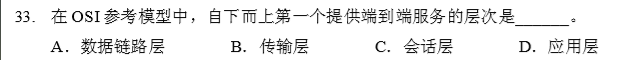
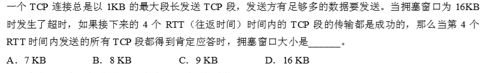
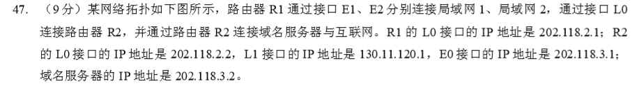
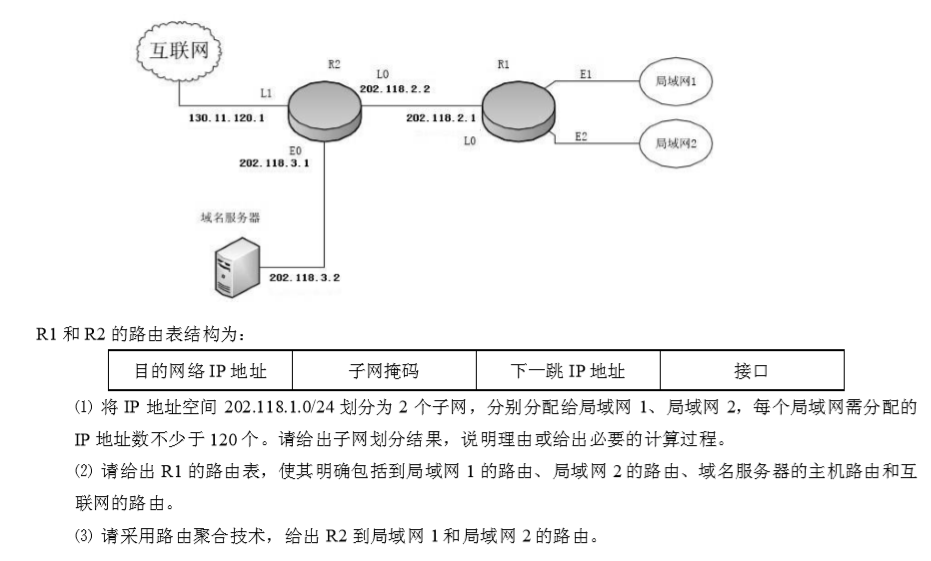
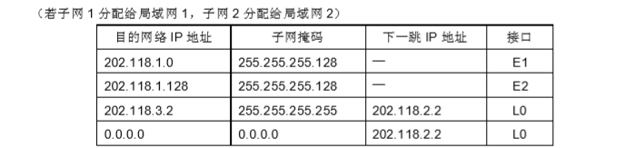
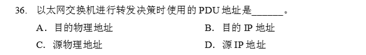
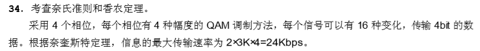

# OSI

## 基本概念

### 一个ip报的旅途
​		【1】网络层把ip地址加在ip数据报首部（如果超过了本地网络的最大值就要分片）
​		【2】接着这个报经过数据链路层协议被分组封装成（若干个）MAC帧，根据路由表和ARP缓存在其头部加上目的MAC地址（下一跳MAC地址）。
​		【3】随后主机发送到网关，由网关进入外网
​		【4】在旅途中，路由器解封MAC帧，查看数据报的目的ip地址的网络号，根据路由表选择下一跳，查找ARP缓存后，再封装成新的MAC帧（目的MAC地址变了），转发
​		【5】数据报到达目标网络后，在LAN中通过数据链路层的MAC地址进行ARP地址转换从 ip -> MAC（广播寻址）

### 广播风暴
+ 路由器能隔离广播域，能抑制广播风暴

  + ip层
    			+ 广播：主机号全1
    + 组播：特殊D类IP地址
  + 数据链路
    			+ 广播：目的MAC地址全1（全F）NIC 接收后，由CPU执行协议软件来决定是否处理该帧  			
    + 组播：目的MAC地址的第一 bit 是 1，由NIC（网卡）直接匹配决定是否接收该帧
  

### 交换机和路由器的区别

路由器是连接不同（结构）网络的

交换机是扩大某一网络规模使得更多计算机加入进来的

路由器根据IP寻址

交换机根据MAC地址

路由器可以作为防火墙

交换机不行

### SAP（Service Access Point）
数据链路层：MAC地址

网络层：ip地址

传输层：端口

  

### TCP与虚电路

TCP：在传输层提供抽象的有连接服务，对路由器不可见

虚电路：是网络层提供的，所经过的交换结点都必须保存虚电路状态信息

若使用了虚电路，则无法提供无连接的服务；而传输层的TCP并不影响网络层的无连接服务

  

### 滑动窗口

传输层：协调发送端与接收端之间的流量，窗口大小能动态变化

数据链路层：控制两个相邻结点的流量，窗口大小不能变化

### 复用和分用

传输层：

+ 复用：发送方的多个进程可使用同一传输层协议
+ 分用：接收方收到的数据分发给不同进程

网络层：

+ 复用：发送方不同协议的数据都可以封装成ip包
+ 分用：接收方剥去IP包首部后把数据交给相应协议

## 应用层

### DNS 解析

域名服务器

+ 根服务器：告诉你去哪里找顶级域名服务器
+ 顶级域名服务器：告诉你去哪里找权限域名服务器
+ 权限域名服务器：告诉你去哪里找子域名服务器
+ 本地域名服务器：与客户主机直接交互，访问上述三类服务器

解析方式

+ 递归【基本不用，根域名负载大】

  + 本地域名服务器查根域名服务器，根域名查顶级，顶级查权限，逐层返回结果

+ 迭代【常用】
  + 由本地域名服务器先查根域名，本地域名服务器再查顶级，本地域名服务器再查权限，一直是本地域名服务器在查 [解析](www.abc.xyz.com) 
  + 最坏要查询几次呢？四次【根】【.com顶级】【xyz.com权限域名】【abc.xyz.com权限子域名】
  + 使用UDP，基于53端口

### FTP文件传输

采用C/S方式，基于TCP，建立两个连接，分别由控制进程和数据传输进程两个进程并行

+ 控制连接 21端口：服务端等待客户端连接21端口建立连接，建立后用来传递FTP控制命令
+ 数据连接 20端口：用于传输文件数据的连接，在控制连接建立后收到传输指令后由服务器创建

### 电子邮件

包含的协议

+ 邮件发送协议：SMTP，只能传 7 比特ASCII码，可以在不同的邮件服务器之间传输
+ 邮件读取协议：POP3
+ MIME：一种“非ASCII码”与“ASCII码”相互转换的工具协议
      		

过程

+ 用户代理程序→[SMTP]→发送邮件服务器→[SMTP]→接收邮件服务器→[POP3]→用户代理程序
+ 使用C/S协议，邮件的发送方是Client，整个过程基于TCP链接，发送方基于25端口，接收方基于110端口
+ 一次邮件传输连接的建立是Client，终止也是Client

### http
基于TCP，无状态

### 其它协议

+ DHCP（Dynamic Host Configuration Protocol）：动态主机配置协议，基于UDP，为一台新来的的计算机分配IP地址
  + 请求（租用）一个临时的IP地址的过程中，数据传输是广播（无连接）的，有多个server同时发送和接收，以管理已分配出去的ip地址
+ RIP（Routing Information Protocol）距离向量算法，基于UDP传输路由表
+ BGP（Border Gateway Protocol）：边界网关协议，基于TCP协议

## 传输层/运输层（报文）

### 概念

+ 端对端【进程到进程（端口）】的通信，提供可靠的传输服务

+ 面向通信的最高层（通信子网中没有传输层，只有底下三层），面向用户功能的最底层

+ 端口号：2字节/16bits
  + 服务端
    + 熟知端口号：[0,1023]
    + 登记端口号：[1023,49151]
  + 客户端
    + 短暂端口号：[49152, 65535]

### 功能
+ 差错控制：既要检查报文的首部（网络层只检查这里），又要检查数据部

+ 拥塞控制、服务质量、数据传输管理

### UDP（User Data Protocol）

特点：

+ 简单（头部8B）（只要实现复用和查错功能
+ 实时性好（UDP不做拥塞控制，网络拥塞不影响发送速率
+ 快
  + 发送方在收到应用层下来的报文后，加上首部后，就原封不动传给ip层，不对数据报做分割
  + 接收端也是，收到ip层的数据报拆封后，直接传给应用层

基于UDP的协议：

+ TFTP：小文件传输协议
+ DNS
+ SNMP：简单网络管理协议
+ RTP：实时传输协议

报文格式：头部 + 数据（数据段可以为空）

报文头部结构：

| 源端口号                     | 目的端口号 | UDP报文的长度（Bytes） | 校验和   |
| ---------------------------- | ---------- | ---------------------- | -------- |
| 2 B                          | 2 B        | 2 B                    | 2 B      |
| 可以为 0，代表不需要返回什么 |            |                        | 可以为 0 |

接收方收到数据报后发现不存在对应端口号，就丢弃报文，发送ICMP“端口不可达”

### TCP：（Transmission Control Protocol）

特点：

+ 报文头部复杂（20 B），要提供可靠的传输服务，占用较多的CPU时间

+ 点对点全双工通信，在收发双方都有缓存
  + 发送缓冲区
    + 准备发送的数据
    + 已经发送但还未确认的数据
  + 接收缓冲区
    + 乱序到达的数据
    + 已按序到达，但还未被应用程序接收的数据

+ 面向字节的通信：TCP把应用程序交下来的数据块视为一串无结构的字节流

+ 在不可靠的IP层上建立一种可靠的传输服务：有序，无错，不重复，规定时限内传到

基于TCP的协议：

+ http
+ telnet：远程登录
+ FTP

TCP报的首部：

大小等于：(20 + 4n) Bytes，n 为 0, 1, 2 ... 。首部固定的部分(最小)为20B

固定部分的特殊标志位：

+ 确认位[1b]：ACK
  + ACK=1时，确认号才有效；在建立连接后所有传输的报文ACK=1

+ 确认号[4B]
  + 想要收到的下一个数据报的序号（传输时）

+ 序号字段[4B]
  + 本报文数据段中的第一个字节，在TCP要传送的所有数据中是第几个

+ 同步位[1b]：SYN
  + SYN=1 表示这是一个：在建立连接时的连接请求或连接接受报文

+ 终止位[1b]：FIN
  + 数据报的 FIN=1，表示发这个报的人之后不会再发数据了，单方面终止连接，同时希望接收到这个的人也别再发了
+ 窗口字段[2B]
  + 现在我的接收缓冲区还有这么多空位（单位是字节），你看着办吧

三次握手

+ 客户机说：hello~（SYN=1，这是一次搭讪），my name is x（seq = x，表明身份，我是 x）

+ 服务端听到后说：Hi~（我同意ACK=1了这次搭讪SYN=1）x（ack=x+1，同意的是来自 x 的搭讪），my name is y（我是 y）
  + 服务端选择了 x，开始为这次聊天做心理准备（为这次TCP连接分配资源）

+ 客户机说：wow~（ACK=1） let's（us：我seq=x+1，你ack=y+1） dance
  + 说完开始准备了（为这次TCP连接分配资源）

四次挥手

TCP连接是全双工的，TCP连接中的一方在收到一个FIN后仍能发送数据，因此每个方向都必须单独进行关闭

+ 进程A：劳资（seq=u）不干（FIN=1）了
  + 进程A不再给B打工（A不再发数据给B）

+ 进程B：哦~（ACK=1）那你（ack=u+1）等一下，我算一下工资（seq=v，之前已发送的数据最后一个字节+1）

+ 进程B：嘿（ACK=1），再你妈的见（FIN=1）！拿着我（seq=w）给你（ack=u+1）的钱走吧
  + 进程B不再给A发工资（B不再发数据给A）

+ 进程A：额（ACK=1），我（seq=u+1）是你（ack=w+1）爸爸

> 为什么要等待掌声？【TIME-WAIT】
>
> 1）可靠的实现TCP全双工链接的终止。
>
> 假想网络是不可靠的，你无法保证你最后发送的ACK报文会一定被对方收到，因此对方处于LAST_ACK状态下的SOCKET可能会因为超时未收到ACK报文，而重发FIN报文，所以这个TIME_WAIT**状态的作用就是用来重发可能丢失的ACK报文**。
>
>  2）允许老的重复的分节在网络中消逝。
>
> 当双方想再一次建立新的连接时，来自该连接先前的重复分组都已经在网络中消逝了。

如何维持可靠性

+ 序号：每个字节都有一个序号，每个TCP报携带本报第一个数据字节的序号（首部的序号字段）
+ 确认：TCP默认是累计确认，确认号为下一个想要收到的序号，确认号之前的都已经有序收到
+ 可以重传的两种情况
  + 超时：每个报文段都设置计时器，计时器往返时间RTT动态更新
  + 冗余ACK：已经收到1，然后收到了3，4，5，但我要的是2，所以我发了三个1的ACK，这样你就知道2可能丢失了（注意接收方并不会丢弃3，4，5，而是把它们缓存起来，有点像选择重传

流量控制

+ 使用滑动窗口对收发端进行速率匹配

+ 流量控制只涉及发送端和接收端
  + rwnd：接收方的剩余窗口
  + cwnd：发送方的拥塞窗口，与网络带宽和时延有关

拥塞控制

+ 端点并不了解拥塞的细节，拥塞通常表现为通信时延

+ 拥塞控制涉及网络链路上所有的主机路由器，面对的是整个链路

+ 发送方维护两个窗口
  + rwnd：接收窗口，由接收方实时反映给发送方
  + cwnd：拥塞窗口，由发送方估算拥塞程度实时调整

+ 算法
  + 慢开始和拥塞避免
    + 慢开始阶段：cwnd 从MSS开始，指数增长，直到达到阈值
      + MSS：最大报文段。不能太小，封装到TCP报和IP报会加上固定头部，网络利用率会很低，不能太大，IP报会分片
    + 拥塞避免阶段：达到阈值后，cwnd 每个RTT时间+MSS
    + 在任何时候，一旦检测到超时（拥塞），阈值 ssthresh = cwnd/2，同时 cwnd 立即 = MSS。好处：一旦检测到拥塞，能迅速减少主机发送到网络中的分组数
  +  快重传和快恢复
    + 快重传：利用了冗余ACK，提前感知到网络拥塞（收到3个冗余ACK）
    + 快恢复：发送窗口的变化跟慢开始基本一致，唯一的不同点在于，当发送窗口达到阈值后，cwnd不再从MSS开始，而是直接等于新阈值（原阈值的一半），直接进入线性加大环节

**发送方的实际发送窗口大小由流量控制和拥塞控制共同决定（较小的一方）**

---

【解释】传输层提供应用进程间的逻辑通信，即端到端的通信。而网络层提供点到点的逻辑通信

【考查 TCP 的拥塞控制方法】 无论在慢开始阶段还是在拥塞避免阶段，只要发送方判断网络出现拥塞 （其根据就是没有按时收到确认），就要把慢开始门限 ssthresh 设置为出现拥塞时的发送方窗口值的一半 （但不能小于 2）。然后把拥塞窗口 cwnd 重新设置为 1，执行慢开始算法。这样做的目的就是要迅速减 少主机发送到网络中的分组数，使得发生拥塞的路由器有足够时间把队列中积压的分组处理完毕。 因此，在发送拥塞后，慢开始门限 ssthresh 变为 16/2 = 8 KB，发送窗口变为 1 KB。在接下来的 3 个 RTT 内，拥塞窗口执行慢开始算法，呈指数形式增加到 8 KB，此时由于慢开始门限 ssthresh 为 8 KB， 因此转而执行拥塞避免算法，即拥塞窗口开始“加法增大”。因此第 4 个 RTT 结束后，拥塞窗口的大小为 9 KB

## 网络层（数据/分组）/IP层

### 路由协议

**自治系统内部网关协议（IGP）**

+ 静态：高度安全的军事系统，适用于较小的商业网络

+ 动态

  + RIP：距离-向量路由算法

    + 跳数作为距离，最大值为15，等于16时认为不可达，适用于小型互联网
        + 跳数=源主机到目的主机之间经过的路由器的数量
    + RIP中的每个网络的子网的掩码都相同（因为它不广播RIP）
    + 是应用层协议，使用UDP传输数据（520端口）
    + 算法
      + 每隔一定时间（30s）相邻路由器交换自己的路由表，看看邻居路由器能给我带来什么能到达的或者更近的路径
        + 路由表表项：<目的网络N，距离d，下一跳路由器X>
      + 若一段时间（180s）没收到邻居的消息，就认为它不可达，把下一跳为它的表项距离设为16
    + 算法特点
        + 网络规模越大，交换路由表的代价就越大
        + 网络出现故障时，收敛会慢，坏消息传得慢
  + OSPF：链路状态路由算法
    + 每个节点都有自治系统内部完整的网络拓补信息，广播时洪泛给其它节点
    + 适用于大型互联网，可以将大范围划分成小范围，支持可变长度子网划分和CIDR
    + 是网络层协议，直接用IP数据报交换信息
    + 算法：洪泛交换链路状态后，构造拓扑图，使用Dijkstra算法找出最短路径的下一跳，构造路由表
    + 算法特点：只有当链路发生变化的时候，才洪泛广播

**外部网关协议（EGP）**

+  BGP-4：边界网关协议
  + 两个不同的AS之间路由
  + 支持CIDR
  + 能找到到达目的AS的路径，但非最佳
  + 算法
    + 每个AS选出一个或多个路由器代表这个AS（发言人）
    + 初始时这些发言人与邻居交换（TCP）路由表
      + 路由表项：目的网络前缀（CIDR），下一跳，到达目的地的路径（路由器）序列
    + 之后只在发生变化的时候，更新变化的部分（不交换整个表）

**最长前缀匹配原则**：当路由表中由多个网络地址匹配到一个分组的目的地址时，选择最长的地址对应的表项去转发

### IPv4

**IP报的结构** = 首部 + 数据部分

计算量：

+ 首部长度：首部的长度，基本单位为 4B
+ 总长度：IP数据报的总长度，基本单位为1B
  + 这里总长度由16个bit 表示，即最大为 65535 B，但以太网帧的MTU为1500B，所以IP报不能超过1500B
+ 片偏移：因为链路层MTU的限制，所以较长分组必须分片传输，分片的基本单位为 8B，遇到不能整除的向上取整
  + 片偏移即片（除头部的数据部）在原分组中的相对位置基本单位同样是为 8B，对应的

**IP地址** = [网络号]+(主机号) = = 32 bits/4 Bytes

+ 网络号是唯一的，IP管理机构只分配网络号\n路由器转发分组也只根据网络号，主机号由网络号单位自行分配

+ 每个网络有一个ip地址，路由器连接两个网络，则路由器至少有两个ip地址（不同网络号），路由器每个端口一个ip地址

**IP地址的传统分类**

+ A类：0 + [7] + (24)：可用的网络数为 2^7 - 2 个
  + 不可用的网络号：
    + 0 + 0000000 + (24x0)：0.0：保留地址（本网络）\n只能做源地址，不能做目的地址
    + 0 + 1111111 + (24x0)：127.0：环回测试地址
+ B类：10 + [14] + (16)：可用的网络数为 2^14 - 1 个
  + 不可用的网络号：
    + 10 + [14x0]+ (16x0)：128.0：本网络
+ C类：110 + [21] + (8)：可用的网络数为 2^21 - 1 个
  + 不可用的网络号：
    + 110 + [21x0] + (8x0)：192.0.0：本网络
+ D类：1110 + [28]：多播地址
+ E类：1111 + [28]：保留以后使用

**NAT地址转换**

NAT路由器将自己的【公网ip:端口】映射到连接自己的设备的【私有ip:端口】，这些设备共用这个路由器的公网ip地址
NAT路由器在转发数据报时更换ip地址，NAT中使用了端口，NAT协议实际上工作在上一层（传输层）

**子网划分**

将ip地址中的【主机号】再划分为<子网号>，<真·主机号>

子网掩码（32位）：告诉主机或路由器，子网是从哪个位置开始划分

比如 255.255.255.0 前 24位是1，所以这个子网掩码下的ip地址的前24位表示一个子网的网络号

**CIDR**
之前传统 ip 地址分类，网络号的位数是几个固定值（8，16，24），CIDR消除了这些僵硬的分类

ip = <网络前缀> + (主机号) = 222.80.18.18/25：其中“/25”表示其前面地址中的前25位（掩码）代表网络部分（网络前缀），其余位代表主机部分
​

**路由聚合**

将网络前缀相同的连续IP组成“CIDR地址快”，整个块的前缀地址在路由器中只占一个表项

**特殊ip**

+ 主机号全为0表示网络本身
+ 主机号全为1表示本网络的广播地址
+ 255.255.255.255 设计为整个TCP/IP的广播地址，由于路由器对广播域的隔离，所以它等效为本网络广播地址，又叫“受限网络地址”

### 网关
数据去外网所经过的关口（有很多硬件可以实现此功能，比如路由器）

主机的网关是它去Internet路径上的下一个路由器的ip

默认路由：0.0.0.0/0，当数据包迷茫（路由表中找不到下一跳该发给谁）的时候就发给默认目的路由

若路由器连接到互联网（Internet）时，目的地址为0.0.0.0/0，这里就是外面的世界

| 目的ip  | 子网掩码 | 下一跳ip                                 | 接口 |
| ------- | -------- | ---------------------------------------- | ---- |
| 0.0.0.0 | 0.0.0.0  | 去互联网路上下一个路由器的ip（默认网关） | 出口 |

### ipv6
从根本上解决了ip地址耗尽的问题

只有在源结点分片，路径上的路由器不能分片，这一点与ipv4不同

两种ipv4向ipv6过渡的策略

+ 双协议栈：部分主机或路由器装有v4，v6两种协议栈，然后进行转换
+ 隧道技术：将整个ipv6数据报装到ipv4数据报的数据部分，然后通过v4网络传输

地址格式：
​			16个字节，连个字节一组，每个字节表示为16进制
​			CDCD:0000:0000:0000:8475:000A:3900:2020

地址简写：CDCD::8475:A:3900:2020：将连续的全0用一对冒号表示，这个冒号只能出现一次

### ip组播
​		概念
​			源主机发送的单个分组会被一组计算机接收
​			这组计算机的地址即为一个组播地址，传统ipv4中是D类
​			仅应用UDP
​		特点
​			“尽最大努力交付”不提供可靠交付
​			组播地址只能用于目的地址
​			组播数据报不产生ICMP差错报文，所以是永远PING不通的
​			不是所有的D类地址都能作为组播地址
​		组播地址的映射
​			ip → MAC地址
​			'0' + ip的后23位 = 24位 = 3字节 \n 将每个字节写成双16进制，作为MAC地址的后三节即可
​			比如 D类ip：224.215.145.230 = 224.[11010111].145.230 \n 第9为变成0后得到 [01010111].145.230，写成16进制为 57-91-E6，最终的MAC地址为：01-00-5E-57-91-E6

### 协议
​		ARP（Address Resolution Protocol）地址解析协议：每个主机/路由器有ARP高速缓存，存放IP到MAC地址的映射 \n 缓存中没有，就广播【全'F' MAC地址】一下，然后等应答，填入缓存即可
​		ICMP（Internet Control Message Protocol）网际控制报文协议：让主机或者路由器报告差错和异常情况 \n 常见的应用为的（win）ping 和（unix）traceroute
​			ICMP的报文类型
​				差错报文
​					时间超过
​						TTL = 0
​					源点抑制
​						拥塞控制
​					参数问题
​						差错控制
​					改变路由
​					终点不可达
​				询问报文
​					回送请求和回答
​						PING
​					时间戳请求和回答
​					掩码地址请求和回答
​					路由器询问和回答报文
​						Traceroute
​		IGMP（Internet Group Manage Protocol）因特网组管理协议：主机通过该协议加入组播组
​		其它协议：IPX、RARP

### 设备
​		路由器
​			数据报的交付方式
​				直接交付
​					源与目的在同一个网络上
​				间接交付
​					源与目的在不同的网络上，需要查询路由表并转发
​			作用
​				隔离了广播域
​				可作为最基础的包过滤防火墙
​				基本功能：分组转发，路由计算
​				隔离冲突域和广播域
​				拥塞控制：发送源点抑制ICMP报文
​				差错检验：丢弃有差错首部的报文，但不能确保报文不会丢失
​			结构
​				路由选择处理机
​					核心数据结构：路由表
​				交换结构（分组转发）
​					核心数据结构：转发表（根据路由表得来的）
​					转发表的结构：[目的地址]【下一跳MAC地址】
​			特点
​				互联多个网络，有多个硬件地址，（也有多个IP地址）
​				实现了物理层、数据链路层、网络层三层的协议与功能
​				通信子网中只有这三层

---

【答】

(2)：直接相连的网络下一跳留空；指向具体主机的子网掩码全 1，另外默认网关的ip为 0.0.0.0/0。

(3)

---

## 链路层

---

【解释】交换机实质上是一个多端口网桥，工作在数据链路层，数据链路层使用物理地址进行转发，而转发 通常都是根据目的地址来决定出端口。 

---

## 物理层

---

【解释】采用 4 个相位，每个相位有 4 种幅度的 QAM 调制方法，每个信号可以有 16 种变化，传输 4bit 的数 据。根据奈奎斯特定理，信息的最大传输速率为 2×3K×4=24Kbps。 