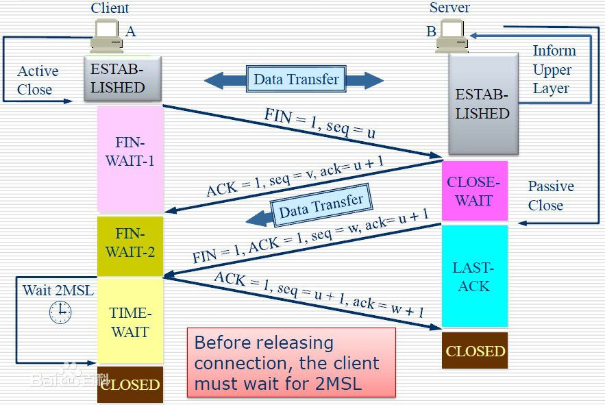

# WTF

## TCP

###三次握手

客户端：我想连你【X】

服务端：我知道了【X+1】你确定吗【Y】

客户端：是的我确定【Y+1】

###四次挥手

> TCP连接是全双工的，一个TCP连接在收到一个FIN后仍能发送数据，因此每个方向都必须单独进行关闭。

主动方：我想关闭了【u】

被动方：好的我知道了【u+1】，你等我一下【v】

被动方：我也准备好要关闭了【w】，开始你的表演【u+1】

主动方：好的【w+1】，那我开始了【u+1】。

主动方：等待掌声【TIME-WAIT】



> 为什么要等待掌声？【TIME-WAIT】
>
> 1）可靠的实现TCP全双工链接的终止。
>
> 假想网络是不可靠的，你无法保证你最后发送的ACK报文会一定被对方收到，因此对方处于LAST_ACK状态下的SOCKET可能会因为超时未收到ACK报文，而重发FIN报文，所以这个TIME_WAIT**状态的作用就是用来重发可能丢失的ACK报文**。
>
>  2）允许老的重复的分节在网络中消逝。
>
> 当双方想再一次建立新的连接时，来自该连接先前的重复分组都已经在网络中消逝了。

##虚函数

### pure virtual

含有纯虚函数的类叫抽象类，抽象类无法实例化。纯虚函数由子类实现，没有实现该函数的子类依然是抽象类，即无法被实例化

```c++
virtual void func1() = 0;
```

### virtual

父类提供默认的实现：子类可以重写函数来覆盖

```c++
virtual void func2()
{
    // do default thing
}
```

### why & how virtual

```c++
class Shape
{
public:
    virtual void virtual_draw() { cout<<"base shape in virtual_draw"<<endl; }
    void virtual_func()
    {
        virtual_draw();
    }
    void normal_draw() { cout<<"base shape in normal_draw"<<endl; }
    void normal_func()
    {
        normal_draw();
    }
};

class Circle : public Shape
{
public:
    void virtual_draw() { cout<<"I'm a circle in virtual_draw"<<endl; }
    void normal_draw() { cout<<"I'm a circle in normal_draw"<<endl; }
};

int main()
{
    Circle shape1;
    shape1.virtual_func(); // I'm a circle in virtual_draw
    shape1.normal_func();  // base shape in normal_draw
}
```

因为在抽象类中，会建立虚函数列表，如果这个类的子类有重写虚函数，则子类的重写会覆盖列表中的原虚函数，所以在列表里查找并执行函数时就会找到子类的方法。

如果没有声明 virtual，就执行类内部的方法

### tips

```c++
class A
{
public:
    virtual void aa(){};
};
class B
{
public:
    void bb(){};
};

cout<<sizeof(A)<<" "<<sizeof(B); // 4 1
// 虚函数列表的指针大小为 4

//-------
class D { char a[0];};				// sizeof = 0

class D_S:public D { };				// sizeof = 0

class D_V:public virtual D { };		// sizeof = 4

class D_V_S:public D_V { };			// sizeof = 4

class D_V_V:public virtual D_V { };	// sizeof = 4

//-------
class D { char a[0];};					// sizeof = 0

class D_S:public D { };					// sizeof = 0

class D_V:public virtual D {char a[0];};// sizeof = 4
class D_V:public virtual D {char b[0];};// sizeof = 4

class D_V_S:public D_V { };				// sizeof = 4

class D_V_V:public virtual D_V { };		// sizeof = 8
```

对于虚继承，如下

```c++
class A public virtual B
```

会在A里多一个指针，指针指向父类表，它（父类表）的意义在于当存在多个父类继承至同一父类时，不会产生二义性，如下图

​      A         class A { public: void func(){ cout<<"A"<<endl; } }

   /      \

 B        C    class B:virtual public A;

   \      /      class C:virtual public A;

​      E          class D:public B,public C;

这个时候 d.func(); 不会有任何问题