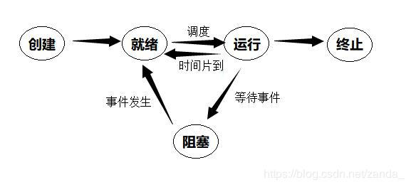

## 概述

###知识储备

系统软件包括：操作系统，数据库管理系统，语言处理程序，服务性程序，标准库程序

并发和共享是操作系统最基本的特征：两者相互依存

BIOS是一组固化到计算机主板上的一个ROM芯片里的程序，是计算机的开启时运行的第一个程序，主要功能是为计算机提供最底层的、最直接的硬件设置和控制。

###OS提供的接口

1：联机和脱机两种命令接口，其中

+ 脱机：类似于批处理程序，一次性写好一次性执行
+ 联机：命令行，输入一句执行一句，涉及到【命令解释器】和【shell】

2：提供给程序的接口叫【系统调用】，又叫【广义指令】

### 发展，类型

单道批处理：最简单串行

多道批处理：中断技术，并发执行，吞吐量高，但不能交互，用户响应时间长

分时操作系统：多个用户同时使用一台计算机，能够人机交互

实时操作系统：在严格时限内处理完任务（及时性），可靠性

---

【例】与单道程序系统相比，多道程序系统的优点是

系统开销小（错误：需要额外的开销来组织，调度作业

IO设备利用率高（√）

---

【例】采用（优先级+非抢占式调度算法）来缩短分时系统的系统响应时间

优先级：使得重要的作业能及时响应

非抢占：不重要的作业也不会因为被抢占而迟迟不能处理完毕

---

【例】多任务操作系统具有并发和并行的特点（√，并发执行进程；CPU与IO并行，CPU与通道并行）

### 核心/用户态

CPU执行不同权限指令时的状态

**核心态**：特权指令

+ I/O指令
+ 置中断指令
+ 存取用于内存保护的寄存器的指令
+ 送程序状态字到寄存器的指令
+ 与硬件关联紧密的模块
    + 时钟管理：处理和时间有关的信息，比如系统时间、进程时间片、延迟、CPU使用时间、各种定时器
    + 中断处理程序
    + 设备驱动
+ 运行频率较高的程序
    + 进程管理程序
    + 存储器管理程序
    + 设备管理程序
    + 原语：原子操作指令，不可被中断的（执行原语是会关闭中断功能）

**用户态**

+ 命令解释程序
+ 调用系统调用
+ 发生缺页
+ 发生外部中断

用户态进入核心态是通过**中断和异常**，这一过程由【硬件】完成；由核心态返回用户态是【操作系统】完成的

+ 中断：也叫【外中断】

    + 时间片中断
    + IO结束中断

+ 异常：也叫【内中断】，源自CPU执行的指令产生的错误，不能被屏蔽，一旦出现要立即处理，处理要依赖当前程序的运行现场

    + 地址越界
    + 虚存缺页
    + 专门的“陷入”指令，访管指令或 trap 指令
    
    

**系统调用的执行过程**：用户进程传递系统调用参数，通过 trap 指令主动让权给内核（进入内核态）这样产生的中断叫【访管中断】，将返回地址压入堆栈，执行被调用的内核服务程序，完后恢复程序现场返回用户态

用户态进入核心态后，使用的堆栈也由用户堆栈切换为系统堆栈，但系统堆栈属于该进程

----

【例】中断处理程序保存：<u>程序的断点（PC），程序状态字寄存器（PSW）</u>，子程序调用需保存：<u>程序的断点（PC）</u>，外部中断处理过程中，PC值由中断隐指令自动保存，操作系统保存：<u>通用寄存器</u>。

---

## 进程管理

### 进程相关概念

进程实体=程序段+相关数据段+PCB（进程控制块）

进程控制用的程序段是【原语】

**状态**

创建过程：

1. OS分配进程标识符PID，申请PCB，如果申请失败，则进程创建失败
2. 复制父进程的环境
3. 分配资源（堆栈，文件…），如果分配失败进程处于阻塞态/等待态
4. 复制父进程空间里的内容
5. 将进程设置为就绪状态，放入就绪队列

就绪态：进程已经获得了除了处理机之外的一切所需资源，一旦得到处理机后就可以运行

运行态：在单处理机环境下，创建了N个进程，每一时刻最多只有N-1个进程处于就绪状态，最多有 1 个处于运行态，最少有 0 个处于运行态（比如死锁导致全部阻塞）

阻塞态：进程正在等待某一事件（某种资源的获取、IO…）而暂停运行

终止过程：

1. 根据终止进程的进程标识符，检索PCB，查看进程状态
2. 若该进程有子进程则全部递归终止（即使正在运行也立即终止
3. 将该进程的所属资源还给父进程或者OS
4. 将该进程的PCB从PCB集合中移除

**异常终止**：存储区越界；保护错；非法指令；特权指令错；I/O故障等

**状态转换**

就绪态→运行态：被调度，进程切换

+ 保存CPU上下文，包括程序计数器和其它寄存器
+ 更新PCB信息，并将PCB移入就绪或等待队列
+ 通过调度算法选择另一个进程，更新PCB并执行
+ 更新内存管理的数据结构
+ 恢复处理及上下文

运行态→就绪态：运行时间片结束；可剥夺的操作系统中被更高优先权进程抢占

运行态→阻塞态：等待某一资源（如外设）或某一事件发生（如I/O操作完成）系统调用中断【主动行为，自己调用Block原语，即只有正在占有CPU的进程才能转换成阻塞态】

+ 检索PCB
+ 保护现场，更改状态，停止运行
+ 将该PCB插入相应事件的等待队列

阻塞态→就绪态：I/O操作结束，中断结束【被动的，需要其它进程协助，中断处理程序把进程变成就绪态，调用Wakeup原语】

+ 检索PCB
+ 把PCB从该事件的等待队列移出
+ 插入就绪队列，等待被调度

---

【例】就绪队列不空，就绪的进程数目越多，CPU的效率<u>不变</u>（只要就绪队列不空，CPU总是可以调度进程并运行，与就绪队列的大小无关）

【例】以下需要创建新进程的是

+ 设备分配【×】在系统中设置相应的数据结构即可，不需要启动进程
+ 用户登录【√】开机的时候登陆账户，要启动用户桌面、配置用户环境等

---

**进程控制块**：由系统维护，常驻内存，系统中的PCB数量是有限的，有两种组织形式

+ 链接：同一状态的PCB链接成一个队列，阻塞状态由于阻塞原因不同会有多条队列
+ 索引：同一状态的PCB在一个索引表里

---

【例】若一个进程实体由

B：共享正文段

C：数据堆段

D：数据栈段

四部分组成，则下列C语言程序中的数据位于哪一部分

未赋值的局部变量（D）

调用函数传递的实参（D）

malloc 动态分配的区域（C）

const 常量（B）

全局变量（B）

二进制代码（B）

---

###进程间通信

用户进程空间是独立的，进程间不能直接相互访问对方的进程空间

**共享存储**：通过特殊的系统调用，对共享的空间进行读写，这个过程中需要借助同步/互斥工具（P，V操作）

+ 低级方式：基于数据结构的共享
+ 高级方式：基于存储区的共享

**消息传递**：由系统提供发送，接收两个原语来传递格式化的信息

+ 直接通信：发送进程直接把消息挂在接收进程的消息缓冲队列上，等待接收进程取
+ 间接通信：发送进程把消息发给中间实体（信箱），接收进程从信箱取信息

**管道**：用于连接一个读进程和写进程的固定大小的共享文件（pipe文件/缓冲区），视为共享存储的优化

+ 是一种半双工通信，一次只能一个方向
+ 当缓冲区为空，才写入，写满时写操作阻塞
+ 当缓冲区满了，才读出，数据被读取就从缓冲区中删除，所以读完数据缓冲区变空，继续写操作

### 线程

同属一个进程的线程共享该进程所有资源，线程之间可以相互创建撤销，通信不需要操作系统干预

线程是：CPU执行的基本单元，程序执行流的最小单元，独立调度的基本单位，拥有自己的CPU现场

进程是：除了CPU外系统资源分配的基本单元

线程也有【线程控制块】一个进程的多个线程分布在多个CPU上同时执行可以加快进程执行速度

**分类**

用户级线程：应用程序自己维护，内核不管

内核级线程：由内核进行调度维护的

**模型**

+ 多对一：多个用户级线程映射到一个内核级线程，线程管理在用户空间进行，效率较高，但当一个线程使用内核服务时被阻塞会导致整个进程阻塞，同时这多个用户线程并不能并行在多核CPU上

+ 一对一：并发强，但开销大，会影响程序性能
+ 多对多：M 个用户级线程映射到 m 个内核级线程（M≥m），集前两者之所长，优点多

---

【例】系统动态dll库的系统线程，被不同进程调用时，它们是（相同）的线程

（同一个系统线程可以由系统调用被多个不同进程多次调用）

【例】降低进程优先级的合理时机是

A：时间片用完【√】降低优先级让其它进程被调度执行

B：进程刚完成I/O操作，进入就绪队列（为了让其尽快处理I/O结果应该提高优先级）

C：进程长期处于就绪队列（为了防止饥饿现象应该提高优先级）

D：进程从就绪态转为运行态（运行态的进程不应变动优先级）

【例】父进程创建子进程与主程序调用子程序有什么不同？

答：父子进程可以并发执行，而主程序要停在调用原点，子程序开始执行，返回结果后，主程序再继续执行

---

### CPU调度

###信号量

### 死锁

